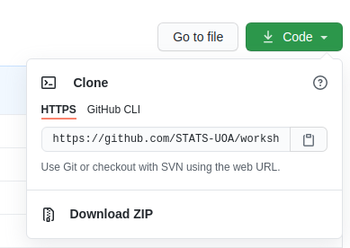
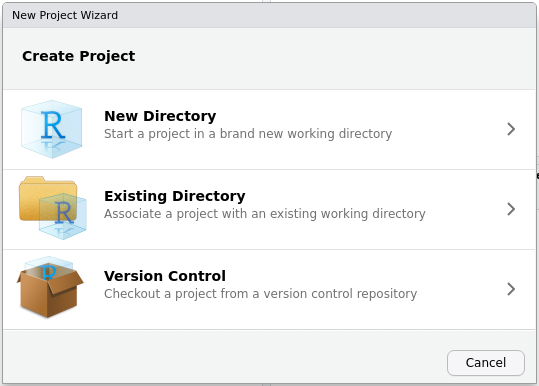
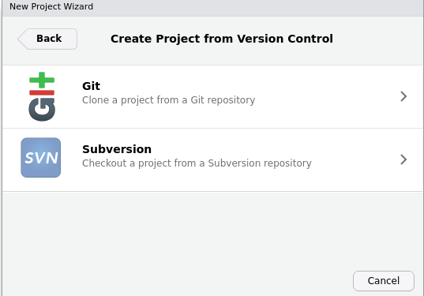
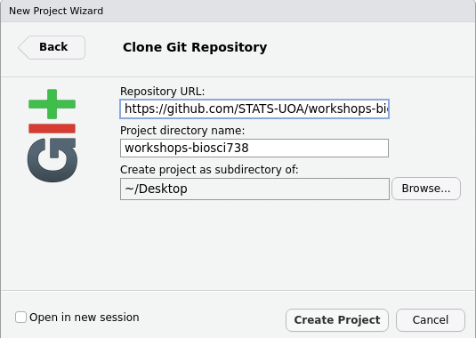
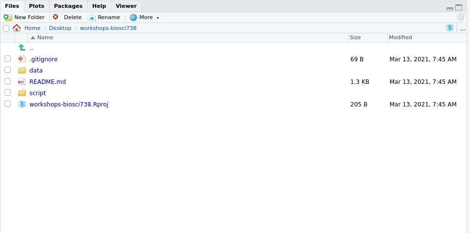
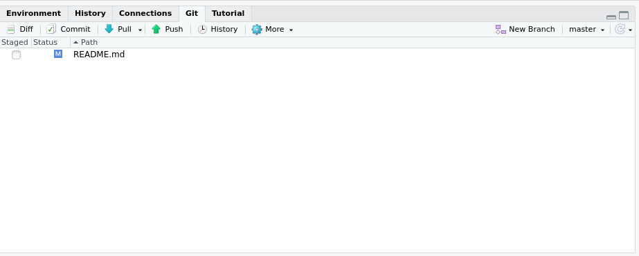
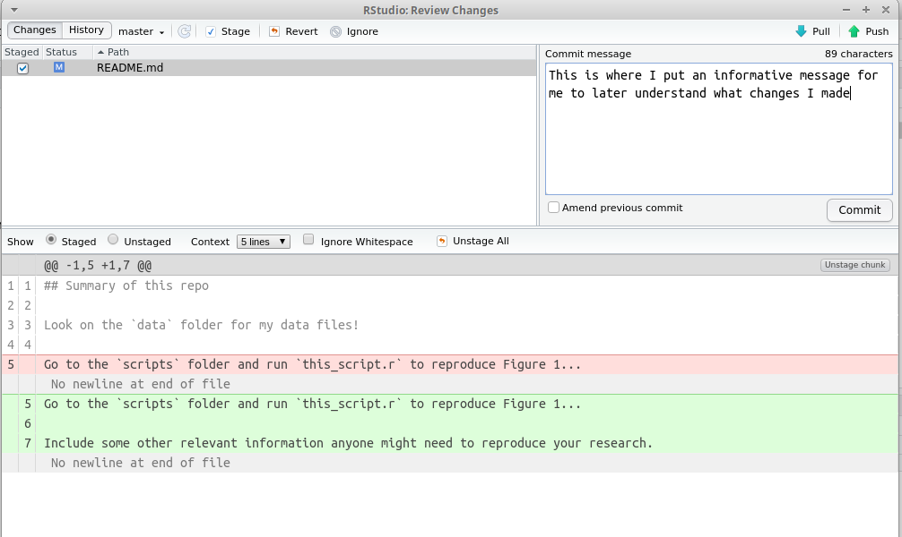
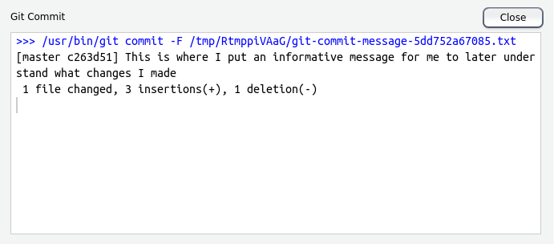
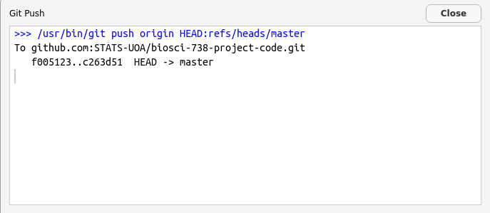

## Accuracy and Honesty

Honesty is an expectation: we expect honesty from you and you expect the same from your teaching team. Honesty is an expectation in any scientific discipline as is accuracy. These are morals, ethical principles we should abide by. But this course isn't here to discuss philosophy or character development. This course, in particular this section of the course, is to expose you to the tools and principles that will aid you in your own pursuit of ethical data practice.


This course doesn't , teaching you the tools so that your analysis is reproducible goes someway towards accuracy. This because, reproducibility promotes transparency, facilitates error detection and correction, and contributes to the overall reliability and accuracy of your research findings.

### Reproducible research

> "Reproducibility, also known as replicability and repeatability, is a major principle underpinning the scientific method. For the findings of a study to be reproducible means that results obtained by an experiment or an observational study or in a statistical analysis of a data set should be achieved again with a high degree of reliability when the study is replicated. ... With a narrower scope, reproducibility has been introduced in computational sciences: Any results should be documented by making all data and code available in such a way that the computations can be executed again with identical results." `r tufte::quote_footer('--- Reprodicibility, Wikipedia')`


Reproducibility is a stepping stone towards ensuring accuracy. This is because, reproducibility promotes transparency, facilitates error detection and correction, and contributes to the overall reliability and accuracy of your research findings. Establishing *good practice* when dealing with data and code right from the beginning is essential. Good practice 1) ensures that data is collected, processed, and stored accurately and consistently, which helps maintain the quality and integrity of the data throughout its lifecycle; and 2) creates a robust code base, which can be easily understood and adapted as the project progresses, which leads to faster development.

### Good coding practice


**Always start with a clean workspace** **Why?** *So your ex (code) can't come and mess up your life!* To ensure this go to **Tools** > **Global Options** and uncheck the highlighted options.

<p align="center">{width="40%"}</p>

**Why?** Because, this is not reproducible, does **NOT** create a fresh `R` process, makes your script vulnerable, and it **will** come back to bite you.

<div class="alert alert-warning">
  <strong>TASK</strong> Below are two quotes from [Jenny Bryan, an `R` wizard](https://jennybryan.org/about/) which reference two snippets of `R` code. Find out what each snippet does and why Jenny is so against them.

> If the first line of your R script is
> `setwd("C:\Users\jenny\path\that\only\I\have")`
> I will come into your office and SET YOUR COMPUTER ON FIRE 🔥. `r tufte::quote_footer('--- Jenny Bryan, Tidyverse blog, workflow vs script')`


> If the first line of your R script is
> `rm(list = ls())`
> I will come into your office and SET YOUR COMPUTER ON FIRE 🔥. `r tufte::quote_footer('--- Jenny Bryan, Tidyverse blog, workflow vs script')`

</div>


A project-oriented workflow in `R` refers to a structured approach to organizing and managing your code, data, and analyses. This helps improve reproducibility and the overall efficiency of your work. Within this it is essential essential to write code that is easy to understand, maintain, and share. To do so, coding best practice is to follow the **5 Cs** by being

1. **Clear**
   - *Code Clarity:* Write code that is easy to read and understand. Use meaningful variable and function names that convey the purpose of the code. Avoid overly complex or ambiguous expressions.
   - *Comments:* Include comments to explain the purpose of your code, especially for complex or non-intuitive sections. Comments should add value without stating the obvious.

2. **Concise:**
   - *Avoid Redundancy:* Write code in a way that avoids unnecessary repetition. Reuse functions and use loops or vectorized operations when appropriate to reduce the length of your code.
   - *Simplify Expressions:* Simplify complex expressions and equations to improve readability. Break down complex tasks into smaller, manageable steps.

3. **Consistent:**
   - *Coding Style:* Adhere to a consistent coding style throughout your project. Consistency in indentation, spacing, and naming conventions makes the code visually coherent.
   - *Function Naming:* Keep naming conventions consistent. If you use camelCase for variable names, continue to use it consistently across your codebase.

4. **Correct:**
   - *Error Handling:* Implement proper error handling to ensure that your code gracefully handles unexpected situations. Check for potential issues, and provide informative error messages.
   - *Testing:* Test your code to ensure it produces the correct output. Use tools like unit tests (e.g., with `testthat`) to verify that your functions work as intended.

5. **Conformant:**
   - *Follow Best Practices:* Adhere to best practices and coding standards in the R community. For example, follow the tidyverse style guide or the Google R Style Guide.
   - *Package Guidelines:* If you're creating an R package, conform to package development guidelines. Use the `usethis` package to help set up your package structure in a conformant way.


There are many other good practice tips when it comes to coding these include ensuring your code is modular, implementing unit testing, automating workflows and implementing version control. In this course you will be using `git` to manage your project code and data. Use of `git`, or similar, will very likely be an expectation of your future career.


## Version control with `git` and GitHub


Git is a version control system that manages the evolution of a set of files, called a repository (repo), in a structured way (think of Word's Track Changes). With `git` you can track the changes you make to your project/code. You will **always** have a record of what you've worked on and can easily revert back to an older version if you make a mistake. GitHub is a hosting service that provides a home for your `git`-based projects on the internet (think of Dropbox). In addition, GitHub offers functionality to use `git` online via an easy-to-use interface. Both `git` and GitHub can very easily be configured to work with RStudio.
  
Below are some key terms you will undoubtedly hear when delving into the git--GitHub world.

**Repository** (already mentioned) This where the work happens--think of it as your project folder. It should contain all of your project’s files etc.

**Cloning** A repository on GitHub is stored remotely in the cloud. To create a local copy of this repository you can clone it and use Git to sync the two.

**Committing** and **pushing** are how you can add the changes you made on your local machine to the remote repository in GitHub. You can make a commit when you have made milestone worthy changes to your project. You should also add a helpful commit message to remind future you, or your teammates, what the changes you made were (e.g., fixed the bug in my_function).

### Setting up

 1.  Register an account with GitHub [https://github.com](https://github.com). Choose the free option!
 2.  Make sure you've got the latest version of `R`
```{r version}
R.version.string
```
 3. Upgrade `RStudio` to the [new preview version](https://rstudio.com/products/rstudio/download/preview/) (*optional*)
 4. Install git: follow [these instructions](https://happygitwithr.com/install-git.html)
 5. [Get started](https://happygitwithr.com/hello-git.html)

### Cloning a repository from `GitHub` using `RStudio`

  1. In `GitHub`, navigate to the Code tab of the repository and on the right side of the screen, click `Clone or download`.
  2. Click the `Copy to clipboard` icon to the right of the repository URL 
  <p align="center">{width="50%"}</p>
  
  3. Open `RStudio` in your local environment
  4. Click `File`, `New Project`, `Version Control`, `Git`
  <p align="center">{width="40%"}{width="40%"}</p>
  
  5. Paste the repository URL and enter TAB to move to the `Project directory name` field.
  <p align="center">{width="50%"}</p>
  
  6.Click `Create Project`. Your *Files* pane should now look similar to this
  <p align="center">{width="50%"}</p>

### Commiting and pushing changes

 1. Open a file from your project directory (here I've opened the file `README.md`). Note that the `Git` pane (top right) is empty
 
 <p align="center">{width="60%"}</p>
 
 2. Make a change to your file and save. Now note that the `Git` pane (top right) is not empty:
 
 <p align="center">{width="50%"}</p>
 
 3. Check this file in the `Git` tab (it is now *staged* for commit).
 
 4. Click the **Commit** button. A new pane will open. Changes made to the file will be highlighted (additions in green and deletions in red). Now write your self an **informative** message in the top right of this pop-up:
 
 <p align="center">{width="60%"}</p>
 
 5. Click the **Commit** button below the message you've just written. A new pop up will let you know how things are going! You can then close both popups.
 
 <p align="center">{width="50%"}</p>
 
 6. Now you'll see RStudio has left you a little message in the `Git` tab, something similar to `Your branch is ahead of origin/master by 1 commit`. This means that you've made and commited your changes locally (i.e., on your computer) but you are yet to **push** these changes to GitHub.
 
 7. To **push** to GitHub press the **Push** button, {width=10%}
 
 8. A new pop up will let you know how things are going! You can then close this once it gives you the option to.
 
  <p align="center">{width="50%"}</p>
 


