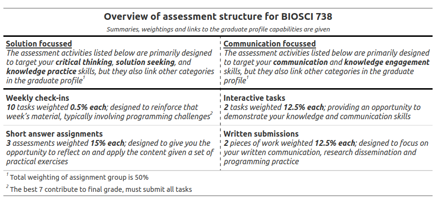

# Key Information {-}

<div class="alert alert-danger" role="alert">
<span><strong>**Please read this page carefully as it contains important information about the course structure, delivery, and assessment.**</span></strong>
</div>

### Overview {-}

This is a postgraduate course geared towards students of biology, ecology, and environmental science. Building on a strong foundation in quantitative biology, fundamental statistical methods and basic R programming, you will learn an array of advanced biostatistical methods for data analysis. Topics covered include data wrangling, methods for the analysis of designed experiments, regression analysis, including mixed effect models, and the analysis of multivariate data, including advanced supervised and unsupervised learning techniques. 

#### Prerequisites {-}

BIOSCI738 is a postgraduate course and so is pitched at a level where some fundamentals of `R` and stats are already assumed (e.g., topics covered in [BIOSCI220](https://biosci220.github.io/BIOSCI220/)). Topics (e.g., linear regression, hypothesis testing etc.) are recapped in the material, but the pace is quite a bit quicker than for a UG course (as we do then delve further into them). It is expected that you will do quite a bit of further reading/working through problems in your own time. How much extra time this takes up will depend on what baseline knowledge you come into the course with. We will use the programming language `R` throughout the course (through RStudio) and you are expected to be familiar with data import, manipulation, and visualization. If you are unfamiliar with `R` it is expected that you will prepare accordingly before the semester begins. If you find yourself struggling a lot with basic `R` tasks then you’ll likely have to spend a lot more time tacking the questions etc. The provided materials will definitely help you here, but you’d likely find that you’d need to recap & cover them in more detail than we might cover in the lectures/labs. 

<div class="alert alert-danger" role="alert">

<span><strong>Before the course begins you are required to complete the [pre-course tasks](https://canvas.auckland.ac.nz/courses/120054/modules#module_360872).</span></strong>


</div>

These tasks are designed for you to self-assess your `R` and statistics knowledge. If you fail to complete the coding task and score less than 70% on the quiz you will likely struggle with the pace and content of the course. This does not preclude you from taking the course, however, you should expect to invest time on top of what is expected for a postgraduate course into ensuring that you understand the material. If you feel the need to brush up on your `R` skills here are two resources I'd recommend giving a whorl 1) [RStudio Education](https://education.rstudio.com/learn/beginner/) and 2) [`R` for Data Science](https://r4ds.had.co.nz/). There are plenty of others out there so if these don't suit you then I'd strongly encourage you to try some others until you find something that suits your learning style.

#### Lectures {-}

<span><strong>Lectures are weekly</span></strong> (weeks 2–12)
 <ul>
  <li>**Mondays**: 9–11 am (Sci Maths & Physics, Room B05), and </li>
  <li>**Fridays**: 2–4 pm (B201, Room 3429). </li>
</ul>

You are expected to attend **all** lectures and to bring along your own device (BYOD) with the appropriate software installed. Each 2-hour lecture will involve a mixture of group work and practical tasks that focus on building computational and inference skills. 

#### Office hours {-}

I hold weekly consultation hours during the semester:

 + **Mondays & Tuesdays 1—2pm**, &
 + **Fridays 1—2pm** (from week 4 onward).
 
These are held in my office in **building 303, room 318**. If you are unable to make these times just email me @ [c.jonestodd@auckland.ac.nz](c.jonestodd@auckland.ac.nz) and we can sort something else out.

#### Assessment summary {-}

<div class="alert alert-danger" role="alert">

<span><strong>There is no test or exam for this course</span></strong> 

</div>





 

### Course policies {-}

<div class="alert alert-danger" role="alert">

If there is any portion of the course that is not accessible to you due to challenges with technology or the course format, please let me know so we can make appropriate accommodations.

</div>

#### Participation {-}

**Discussions** with your classmates are an important element of this course, as this allows me to observe how you **engage** with the material and how you **communicate** your understanding with your peers. A big part of the **learning experience** in BIOSCI738 comes from **asking questions** and brainstorming strategies for achieving increased understanding and insights.

**BIOSCI738 is NOT a class where...**
 
 + You can simply show up and watch/listen without contributing to the discussion.
 + You can do no work for several weeks, and then pull an all-nighter before a big deadline.
 + You can *sit in the back* and be invisible.

**BIOSCI738 IS a class where...**

 + You will take an active role in the class discussions (my role is to facilitate, not to lecture).
 + You will come prepared to engage with the set activities!


#### Academic honesty {-}


<div class="alert alert-danger" role="alert">
<span><strong>TLDR: Don’t cheat! As a student, it is your responsibility to ensure you’re being academically honest.</span></strong> 

**If you need help, ask!** Use office hours or class discussions etc. rather than resorting to dishonest means.

If you are unsure about anything please reach out: email me @ [c.jonestodd@auckland.ac.nz](c.jonestodd@auckland.ac.nz), I'm more than happy to chat!
</div>

You are expected to abide by the following as you work on assignments in this course:

 + All submitted work **must be your own**. Copying verbatim from sources (e.g., internet, or AI-generated content, the courseguide) without proper citation will be treated as plagiarism.
 + You may **discuss** assignments with other students; however, you may not directly share (or copy) code or write up with other students. Unauthorized sharing (or copying) of the code or write up will be considered a violation for all students involved.
 + Unless explicitly stated otherwise you **may make use of online resources** (e.g., StackOverflow or Copilot etc.) for coding examples on assignments. If you directly use code from an outside source (or use it as inspiration), you must explicitly cite where you obtained the code. Any recycled code that is discovered and is not explicitly cited will be treated as plagiarism.
 
In summary, as a student of University of Auckland student, you are responsible for understanding and abiding by the requirements of the [Student Charter](https://www.auckland.ac.nz/en/students/forms-policies-and-guidelines/student-policies-and-guidelines/student-charter.html). 

#### Extensions {-}

Note that extensions will only be granted in **exceptional circumstances** (e.g., illness with a doctor’s note). Last-minute requests due to poor time management, workload from other courses, or minor inconveniences will not be considered sufficient to grant an extension. The goal is to keep everyone on track together; due dates for assignments are there to help you keep up with the course material and to ensure the I can provide feedback within a timely manner. 

No single assessment in this course is worth more than 15% of your final grade. This is by design so that 1) no one assignment should feel overwhelming, and 2) you have multiple opportunities to demonstrate your learning in a variety of ways (see [Assessment summary] for a breakdown of assessment design). Because of this, deadlines for other courses or a busy schedule are not valid reasons for extensions. You’re given plenty of time to complete each assignment, so I encourage you to start early and plan ahead! If you’re facing a genuine issue that will prevent you from submitting your work it is imperative that you get in contact with me **as soon as possible** so that we might make alternative arrangements and figure out the best way to support you.

### FAQs {-}

**What are some recommended resources to help me on my `R` learning journey?** *Some to start out with: 1) [RStudio Education](https://education.rstudio.com/learn/beginner/), 2) [`R` for Data Science](https://r4ds.had.co.nz/), and 3) [Modern Statistics for Modern Biology](https://web.stanford.edu/class/bios221/book/).*

**How do I receive communications and updates on assignments for this course?** *All course communication will be via Canvas Announcement, I expect you to keep up to date with these!*

**Do I need to attend all lectures?** *Yes. I expect students to attend all lectures. You should only miss class in cases of emergencies or serious illness. Otherwise, I expect you to be there, just as you’d expect me to be!*

**Are the classes recorded?** *No, all lectures are in-person and will not be recorded.*

**What if I miss a lecture?** *The expectation is that you catch up on the materials and content yourself before the next session.*

**Do I need to being a laptop to class?** *Yes, please bring along your own device (BYOD) with the appropriate software installed as each lecture will likely involve practical tasks that focus on building computational and inference skills.* 

**I don't have my own laptop.** *No worries, please let me know and I can organise a loan laptop for you.*

**Can I use Gen AI tools in this class?** *It depends! We will discuss this in more detail when lectures start. Please refer to the [Academic honesty] section with regards to submitted work and [this webpage on academic integrity at UoA](https://www.auckland.ac.nz/en/students/forms-policies-and-guidelines/student-policies-and-guidelines/academic-integrity-copyright/about-academic-integrity.html).*

**I need an extension for an assignment, how do I do that?** *Please see the [Extensions] section for the course's extension policy.*

**When will I get my assignment grades?** *Feedback and solutions will be provided as soon as possible and uploaded via CANVAS. Be sure to review your feedback carefully and take some time to reattempt the tasks in line with the solutions as often there are multiple ways of doing the same thing!*

**What if I have a query about my assignment grade?** *Firstly, please read your feedback carefully and take some time to reattempt the tasks in line with the solutions. If you still have concerns, please  email me @ [c.jonestodd@auckland.ac.nz](c.jonestodd@auckland.ac.nz) with a clear explanation as to what specific part of the grade or feedback you are querying.*

**How can I get help if I'm struggling with the content?** *Reach out! Ask me questions in class, attend my [Office hours], or email me @ [c.jonestodd@auckland.ac.nz](c.jonestodd@auckland.ac.nz). You are also welcome to drop by my office unannounced and check if I'm free, but please note I may be in a meeting or working from home some days.*

**I am a NEFU student and need some extra English language support** *Alex Trevarton offers weekly drop in sessions, please see his advert below*

> The MAC3/106-114 room is open to Aulin NEFU students at SBS ever Monday 1pm - 2pm.  Come along with your NEFU classmates to discuss your coursework, or ask any questions you have about the University. I can help you if you are struggling with English, and if you need, we can discuss it using Chinese. 每个星期一下午一点钟，待你的NEFU朋友们来MAC3/106-114房间，寻求建议，聊天。虽然练习英语算最好的，不过要是自信不够的话，我会说一点简单的汉语。Kind regards, Alex (Research Fellow at SBS)

**Any other queries or concerns?** Please contact me @ [c.jonestodd@auckland.ac.nz](c.jonestodd@auckland.ac.nz)

#### Support {-}

<div class="alert alert-success" role="alert">

The [Te Papa Manaaki | Campus Care](https://www.auckland.ac.nz/en/students/student-support/personal-support/te-papa-manaaki-campus-care.html) team provides a safe, confidential and free service that supports the health, well-being and safety of everyone at the University.

Several [crisis helplines](https://www.auckland.ac.nz/en/students/student-support/personal-support/student-health-counselling/emergency-information.html) are available if you are worried about your safety or the safety of someone else, including the Mental Health Crisis Service (Phone: 0800 800 717). Rather text? Need to talk @ 1737 

There are many personal, academic and learning, financial (including emergency funds), and tech support services available to all students—[learn more here](https://www.auckland.ac.nz/en/students/student-support/personal-support/be-well/getting-support.html). 

[Whai Ora Be Well](https://www.auckland.ac.nz/en/students/student-support/personal-support/be-well.html) offers a range of tools and information to help you care for your physical, emotional and spiritual wellbeing, so you can thrive. 

</div>

```{r, echo = FALSE, eval = TRUE, warning=FALSE, message=FALSE}
## install packages used in book if not already
pkgs <- c("tidyverse", "palmerpenguins", "patchwork", "equatiomatic", "vegan",
          "GGally", "ggeffects", "NbClust", "MASS", "png", "factoextra", "lme4",
          "pheatmap", "ade4", "ggfortify", "ape", "distributional", "emmeans", "tufte",
          "kableExtra","devtools", "gglm", "remotes", "predictmeans", "lmerTest", "animation",
          "edibble")
options(warn = -1)
for (i in pkgs){
    if (!require(i, quietly = TRUE, character.only = TRUE)){
        install.packages(i)
    }
  if(!require(emo, quietly = TRUE)){
    devtools::install_github("hadley/emo")
  }
  if(!require(icons, quietly = TRUE)){
    remotes::install_github("mitchelloharawild/icons")
    icons::download_fontawesome()
  }
}
options(warn = 0)
## so students see library()
library <- require
```


