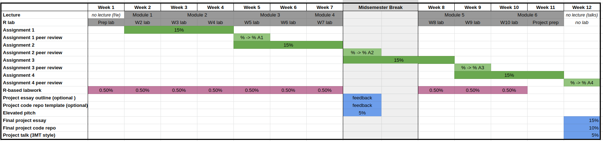

# Useful information to set you up for your semester {-}

### Course outline {-}

This is a postgraduate course geared towards students of biology, ecology, and environmental science. It is suited to students with an interest in (bio)statistics who would like to equip themselves with the know-how to be able to correctly prepare experiments, analyse data, interpret their results and draw valid conclusions. 
 
The statistical concepts and methods taught in this course will provide students with the tools to make and evaluate scientific discoveries as well as propose and justify decisions based on data. The course builds on assumed knowledge of some fundamental statistical concepts. It is expected that students are comfortable with the statistical content covered in a typical stage 2 biostatistics course (e.g., BIOSCI220). 
 
This course will use the programming language `R` (through RStudio) and students are expected to be familiar with the basics of data import, manipulation, and visualisation using `R`. If you are unfamiliar with `R` it is expected that you will prepare accordingly prior to lectures and labs. The course will also introduce you to version control (via git and GitHub); no previous experience with these systems is expected.

### Learning Outcomes {-}

By the end of this course you will be able to:

  + **Discuss** and **critically evaluate** the provenance of data and **create** informative visualisations. 
  + **Develop** and **demonstrate** effective `R `programming and version control skills. **Create** and maintain a reproducible project directory. 
  + **Describe**, **analyse** and **interpret** different types of experimental designs identifying the potential sources of variation. **Formulate** an appropriate hypothesis associated with an experimental design. 
  + **Perform**, **interpret**, and **critique** multivariate data techniques. 
  + **Communicate** statistical concepts and experimental outcomes clearly using language appropriate for both a scientific and non-scientific audience. 
  + **Perform**, **interpret**, and **critique** a range of statistical regression techniques. 

### Course summary {-}

##### Lectures this semester are in weeks (2--11) on **Mondays 2-4pm in MAC1**. Labs are held in **106-014 (Biology Building, Room 014)** on Fridays (weeks 2--11) 2--3pm {-}

##### Office hours: Mondays 12--1pm & Thursdays 2--3pm throughout the semester. Contact me: [c.jonestodd@auckland.ac.nz](mailto:c.jonestodd@auckland.ac.nz) or at science building 303, level 3, office 318 {-}

##### Each week some lecture material will be recorded and uploaded to CANVAS. It is expected that you will have watched these prior to coming along to the in-person lecture {-}

