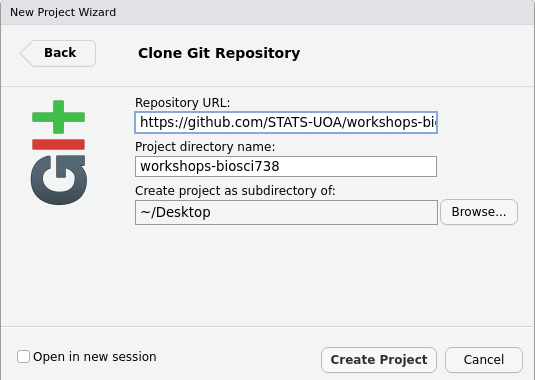
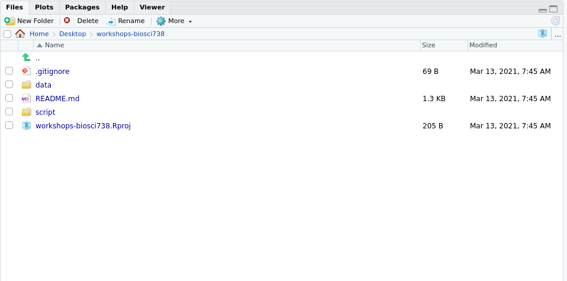
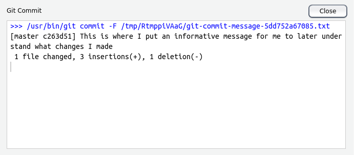

## Reproducible research

> "Reproducibility, also known as replicability and repeatability, is a major principle underpinning the scientific method. For the findings of a study to be reproducible means that results obtained by an experiment or an observational study or in a statistical analysis of a data set should be achieved again with a high degree of reliability when the study is replicated. ... With a narrower scope, reproducibility has been introduced in computational sciences: Any results should be documented by making all data and code available in such a way that the computations can be executed again with identical results." `r tufte::quote_footer('--- Reprodicibility, Wikipedia')`


### Project-oriented workflow: good practice

Properly managing data and other research outputs should starts at the beginning of your project. It should then and continue throughout!

To setup an RStudio `.RProj` project go to **Project** (top right) > **New Project** > **Create Project** 

**Best-practice tips**

 + Be organised: set up each each assignment/university course as a *project*
 + Ensure your project is self-contained. A *project* is a folder that should contain all the relevant files and all paths should be relative to that *project*
 + Always apply the 5 Cs: be **C**lear, **C**oncise, **C**onsistent, **C**orrect, and **C**onformant.
 + Naming files should be descriptive and consistent! 
 + Include a README file that summarises your project's structure
 + Provide a detailed description of the data, data source(s), and how it will be used.
 + Describe all the steps of data preprocessing.
 + Provide a description and information about each new version of the data.
 + Provide details about the software/code that is used for preprocessing the data.
 + Include brief examples of how your code works. 
 + Generate a list of all scripts, how to run them, and in what order.
 + When structuring your project directory consider the following:
   + Put code and data in separate subdirectories.
   + Plan to separate raw data from processed data.
   + An example of a well-structured directory  
      + ProjectName/
         + README.MD
         + Dataset/
             + Raw Data/
             + Processed Data/
         + Analysis (or Code or Scripts)/
             + Data cleaning/
             + Data preprocessing/
         + Output/
             + Graphs
             + Tables

**Always start with a clean workspace** **Why?** *So your ex (code) can't come and mess up your life!*

<p align="center">{width="30%"}</p>


To ensure this go to **Tools** > **Global Options** and uncheck the highlighted options.

<p align="center">{width="50%"}</p>


**`r emo::ji("warning")`Warning`r emo::ji("warning")`**

> If the first line of your R script is
> `setwd("C:\Users\jenny\path\that\only\I\have")`
> I will come into your office and SET YOUR COMPUTER ON FIRE 🔥.
> If the first line of your R script is
> `rm(list = ls())`
> I will come into your office and SET YOUR COMPUTER ON FIRE 🔥. `r tufte::quote_footer('--- Jenny Bryan, Tidyverse blog, workflow vs script')`

**Why?** Because, this is not reproducible, does **NOT** create a fresh `R` process, makes your script vulnerable, and it **will** come back to bite you.


### Version control with `git` and GitHub


<p align="center">{width="40%"}</p>

Git is a version control system that manages the evolution of a set of files, called a repository (repo), in a structured way (think of Word's Track Changes). With Git you can track the changes you make to your project/code. You will **always** have a record of what you've worked on and can easily revert back to an older version if you make a mistake. GitHub is a hosting service that provides a home for your Git-based projects on the internet (think of Dropbox). In addition, GitHub offers functionality to use Git online via an easy-to-use interface. Both Git and GitHub can very easily be configured to work with RStudio.
  
Below are some key terms you will undoubtedly hear when delving into the git--GitHub world.

**Repository** (already mentioned) This where the work happens--think of it as your project folder. It should contain all of your project’s files etc.

**Cloning** A repository on GitHub is stored remotely in the cloud. To create a local copy of this repository you can clone it and use Git to sync the two.

**Committing** and **pushing** are how you can add the changes you made on your local machine to the remote repository in GitHub. You can make a commit when you have made milestone worthy changes to your project. You should also add a helpful commit message to remind future you, or your teammates, what the changes you made were (e.g., fixed the bug in my_function).

#### Setting up

 1.  Register an account with GitHub [https://github.com](https://github.com). Choose the free option!
 2.  Make sure you've got the latest version of `R`
```{r version}
R.version.string
```
 3. Upgrade `RStudio` to the [new preview version](https://rstudio.com/products/rstudio/download/preview/) (*optional*)
 4. Install git: follow [these instructions](https://happygitwithr.com/install-git.html)
 5. [Get started](https://happygitwithr.com/hello-git.html)

#### Cloning a repository from `GitHub` using `RStudio`

  1. In `GitHub`, navigate to the Code tab of the repository and on the right side of the screen, click `Clone or download`.
  2. Click the `Copy to clipboard` icon to the right of the repository URL 
  <p align="center">{width="50%"}</p>
  
  3. Open `RStudio` in your local environment
  4. Click `File`, `New Project`, `Version Control`, `Git`
  <p align="center">{width="40%"}{width="40%"}</p>
  
  5. Paste the repository URL and enter TAB to move to the `Project directory name` field.
  <p align="center">{width="50%"}</p>
  
  6.Click `Create Project`. Your *Files* pane should now look similar to this
  <p align="center">{width="50%"}</p>

#### Commiting and pushing changes

 1. Open a file from your project directory (here I've opened the file `README.md`). Note that the `Git` pane (top right) is empty
 
 <p align="center">{width="60%"}</p>
 
 2. Make a change to your file and save. Now note that the `Git` pane (top right) is not empty:
 
 <p align="center">{width="50%"}</p>
 
 3. Check this file in the `Git` tab (it is now *staged* for commit).
 
 4. Click the **Commit** button. A new pane will open. Changes made to the file will be highlighted (additions in green and deletions in red). Now write your self an **informative** message in the top right of this pop-up:
 
 <p align="center">{width="60%"}</p>
 
 5. Click the **Commit** button below the message you've just written. A new pop up will let you know how things are going! You can then close both popups.
 
 <p align="center">{width="50%"}</p>
 
 6. Now you'll see RStudio has left you a little message in the `Git` tab, something similar to `Your branch is ahead of origin/master by 1 commit`. This means that you've made and commited your changes locally (i.e., on your computer) but you are yet to **push** these changes to GitHub.
 
 7. To **push** to GitHub press the **Push** button, {width=10%}
 
 8. A new pop up will let you know how things are going! You can then close this once it gives you the option to.
 
  <p align="center">{width="50%"}</p>
 


