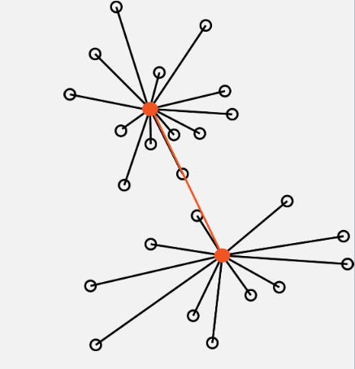

## Clustering

So, it's all about variation again! And the idea of minimizing it.


Cluster analysis, or classification as it is known in the botanical literature, has the apparently simple
aim of finding clusters in a data cloud of sampling units in the absence of any a priori information
about which point belongs in which cluster. This apparently unambitious aim is unfortunately
fraught with problems.
The major difficulty is that no one seems to agree on precisely what a cluster is. For a very good
reason, the human eye is unexcelled as a pattern recognition device, but we recognise clusters of
points in a variety of different ways. For example, it is extremely difficult to think of a single
definition that would adequately describe all the clusters in fig 7.1, even though they are quite
obvious (I hope). Some workers have stressed the importance of cohesiveness (like fig 7.1a); others
contiguity of points (7.1b); yet others have concentrated on distances such that all or most of the
distances within a cluster are less than those to any point outside the cluster; and finally others have
tried to make the definition so vague that it can include most of the possibilities without the
necessity of actually defining anything. Everitt's definition (Everitt 1980) seems to come as close to
being useful as any:
"Clusters may be described as continuous regions of (a) space containing a relatively high density
of points, separated from other such regions by regions containing a relatively low density of
points."
Unfortunately it does not provide a rationale for a single comprehensive technique that can handle
all the data structures shown and satisfy all the requirements of workers. Indeed it is extremely
unlikely that any such method could ever be found, for there lies another problem, workers want the
technique(s) for a number of different purposes:
i) to find groups for classification;
ii) to reduce the number of sampling units in an analysis by using a single representative from each
cluster of similar individuals;
iii) for data exploration and hypothesis generation;
iv) for fitting distribution models and estimating their parameters;
v) dissecting a continuous data cloud into relatively homogeneous zones;
and many more.
The only thing the large number of existing techniques have in common is that unlike canonical
discriminant analysis (section 10) and discriminant function analysis (not covered in this course)
there is no prior information about which sampling unit is in which group. Like the ordination
methods of the earlier chapters, cluster analysis techniques operate on an unpartitioned data matrix
to find, or impose, structure in the data cloud.
One consequence of this variation in definition and use is that cluster analysis as such does not
exist. The title refers to an enormous and extraordinarily diverse family of techniques. For someone
to say that they used cluster analysis is about as informative as their saying they studied an insect.
To cover all the techniques would take a whole (large) book. So for this course I shall content
myself with covering some of the common ones and ones I think are potentially most useful.
Given the diversity of techniques it is very important to choose the technique with a clear idea of
what it is required to do. Like selecting a similarity or distance metric (Section 4), the choice must
be made with care after consideration of the nature of the data, your objectives, and the available
alternatives. However the most important thing to remember when using a clustering technique is:-
you must not believe the result. The pattern you get is at most a plausible way of viewing the data.
By using an appropriate method and by employing validation techniques the plausibility can be
enhanced, but no cluster analysis can be relied on to produce truth. With real data, different methods
will nearly always produce different results. If the structure in the data is fairly obvious then these
answers may not differ much, but if there is any ambiguity in the data then the methods may well
give contradictory results.


### Partitioning methods.

Though the hierarchical methods have been historically more important, the partitioning methods
are becoming increasingly popular, and it is easy to see why. The hierarchical methods are restricted
to an often inappropriate nested structure so that at each level (number of clusters) the solution is
constrained by the previous one. In the partitioning or segmentation methods the solution at any
level is independent of the others and can therefore be globally optimal - if you're lucky.
For a single run of a partitioning method, the desired number of clusters ( k ) is usually fixed - some
techniques do allow some small adjustment in this number during the process. Of course since the
correct number of clusters is usually not known, the program is normally run with different values
of k and the optimum number of clusters chosen (covered later).
There are two major phases to a partitioning method:
i) an initial allocation (usually rather arbitrary) into k preliminary clusters;
ii) reallocation of each point either to the closest centroid, or so as to optimise some property of the
clusters. This is repeated until there is no further improvement, then the program stops.
The initial allocation is usually started by choosing k sampling units to use as "seeds" to
"crystallise" the clusters. There are a number of ways to choose these seeds; it depends on the
program. As we shall see it is a tremendous advantage if you can put in your own set. These seeds
are used as the initial centres of the clusters, points are allocated to the nearest cluster centre, and in
most programs the cluster centroid is adjusted as they are added.
The methods we consider here (there are others) the k -means methods, run through the sampling
units reallocating them to the cluster with the closest centroid; they pass and repass through the data
till no further reallocation of points is possible. Some programs then try swapping pairs of points
between clusters, to further improve the solution, and to protect against local optima. 

#### K-means partitioning methods
The k -means methods are generally the fastest clustering methods, but they are inclined to be
trapped by local optima and tend to produce equal volume spherical solutions. They are also very
ensitive to starting strategy. Some workers suggest that random starting values should not be used.
Seber reports a study as having located the global optimum only 3 times from 24 random starts!
However their performance in the few Monte Carlo simulation studies that have incorporated them
has been good relative to alternative methods, particularly when the solution from a hierarchical
method was used as the starting configuration. In fact, it has tended to be better than the best
hierarchical methods considered (Ward's and average linkage).
If the data set is particularly large, a sub-sample of the points could be clustered and the estimated
centroids of the resulting clusters used as seeds for the analysis of the full data set. Some programs
allow you to vary how the distance to the centroid is measured. Some programs normally use the
squared distance which means that it is minimising the trace( W ) where W is the within cluster
variance-covariance matrix pooled over all the clusters, i.e. the total within sample variance. This is
an appealingly statistical thing to optimise.

### Hierarchical methods.

These methods assume that the groupings in the data cloud have a hierarchical structure. The
smaller groups form larger groups which form larger groups and so on - a nested classification. If
this assumption is untrue then the techniques can be expected to distort the true structure of the
data.
Most of the commonly used techniques are members of this group. They are widely available, all
the major packages have a selection, and they are relatively easy to use, though often less so to
interpret.
Hierarchical organisation is often difficult to justify for real data sets. Though there may be more
than one level of grouping there may be no reason to assume that they are nested. For example, it
has been shown that the clusterings defined by the optimum sum of squares at various levels of k
may not be nested for all data sets; so a hierarchical method may be unsuitable for any given data
set.
There are two approaches to hierarchical clustering, agglomerative and divisive . Agglomerative
methods start from the individual sampling units forming them into groups and fusing the groups
till there is only one that includes all the points. If we can describe this as working from the bottom
up, then the divisive techniques work from the top down. The groups are formed by splitting the
data set successively until there are as many groups as points.

### Hierarchical agglomerative clustering.
All of the commonly used hierarchical methods are agglomerative. Most of them operate in the
same way: first all sampling units that are zero distance apart are fused into clusters. The threshold
for fusion is then raised from zero until two clusters (they may be individual points) are found that
are close enough to fuse. The threshold is raised, fusing the clusters as their distance apart is
reached until all the clusters have been fused into one big one. Thus the close clusters are fused
first, then those further apart, till all have been fused. This process allows the history of the fusions,
the hierarchy, to be displayed as a dendrogram. This is an advantage of the agglomerative methods,
if the data have a nested structure these techniques lead to a useful way of displaying it. Other
advantages are the ready availability of programs and their ability to handle quite large data sets - at
reasonable expense. Unlike the optimisation or k -means methods, most of the agglomerative techniques can use a broad range of similarity or distance measures. This of course means that
considerable care must be taken to choose the appropriate one; different measures often lead to
different results.
Inevitably, given the variety of definitions of a cluster, there are a large number of different
hierarchical agglomerative techniques. They mainly differ in the details of the fusion rule. For most
of them the rule is simply stated: two clusters should be fused if the distance between them has been
reached by the threshold. The problem is to estimate that distance. It can be done in a variety of
ways and will usually affect the results. As we shall see, different types of clusters need different
ways of estimating intercluster distance.
We shall consider the four most commonly used methods.

#### Single linkage (nearest neighbour) clustering.

Single Linkage (*nearest neighbour/minimal jump*): Computes the distance between clusters as the smallest distance between any two points in the two clusters


The distance between two clusters is the distance between their nearest points (Figure 7.3a).The
simplicity of this method makes it easy to program and extremely efficient. It was one of the most
popular techniques in the early days of clustering; but since then, despite support from the
theoreticians, it has been used less frequently. In general it has not performed well. It identifies
clusters on the basis of isolation, how far apart they are at their closest points. This means that if
there are any intermediate points then single linkage will fuse the groups without leaving any trace
of their separate identities. This is called "chaining", which leads to characteristic and rather
uninformative dendrograms. It is the chief weakness of the method. Its strength is that if the clusters
are well separated in the data, then single linkage can handle groups of different shapes and sizes,
even long thin straggly ones (e.g. Figure 7.1c) that other methods often cannot recover. It has other
advantages, it will give the same clustering after any monotonic transformation of the distance
measure - that means that it is fairly robust to the choice of measure. It is insensitive to tied
distances - some methods suffer from indeterminacy if there are too many ties; a bit like degenerate
solutions in non-metric MDS, (section 6.3.3.iii) and though the results are seldom as pretty, they
can be just as meaningless.
As a cluster analysis single linkage is usually not very useful (unless the data is of the right type).
Many investigations have found it performs badly with even slightly messy data.

#### Complete linkage (farthest neighbour) clustering.

+ Complete Linkage (*maximum jump*): Calculates the maximum distance betweentwo points from each cluster


In many respects complete linkage clustering is the opposite of single linkage. Instead of measuring
the distance between two clusters as that between their two nearest members; it uses that between
the two farthest members (Figure 7.3b). In consequence the resulting clusters are compact, spherical
and well defined. Unlike single linkage it can be sensitive to tied distances. There are similarities,
the clustering it gives is also invariant under monotonic transformation of the distances; it is robust
to a certain amount of measurement error and choice of distance. Unfortunately it is sensitive to
even a single change in the rank order of the distances in the dissimilarity matrix (Seber 1984), and
does not cope well with outliers. However, in Monte Carlo simulations, it nearly always performed
better than single linkage; though usually not quite as well as Ward's or group average.

#### Group average linkage (UPGMA)
This is probably the most popular hierarchical clustering method - for a very good reason - it
usually works well. It could be thought of as an attempt to avoid the extremes of the single and
complete linkage methods. The distance between two clusters is the average of the distances
between the members of the two groups (Figure 7.3c). If the distances are Euclidean this is the
distance between the centroids plus the within group scatter. As a result this method tends to
produce compact spherical clusters.
Like its main rival Ward's method, average linkage has generally performed well in Monte Carlo
simulations, and its continued popularity is because it consistently, though not inevitably, gives
adequate results. However, Ward's generally performed better, particularly when there was some
overlap between the groups. When intermediate points and outliers were removed ("trimming" or
"incomplete coverage"), group average's performance was considerably improved. It performed
poorly with mixtures of multivariate normal distributions probably because of the overlap between
clusters..

#### Ward's method (incremental sums of squares, minimum variance, agglomerative sums of squares).

 Ward's method: where the goal is to minimize the variance within clusters



Ward's method is the hierarchical version of the k-means partitioning method. At each fusion it
attempts to minimise the increase in total sum of squared distances within the clusters. This is
equivalent to minimising the sum of squared within cluster deviations from the centroids - i.e.
trace( W ). Since at any one stage it can only fuse those clusters already in existence - it is not
allowed to reallocate points - it can only be stepwise optimal. It cannot find the true minimum
configuration at each level, so it would not be expected to recover natural clusters as well as the
non-hierarchical methods that also minimise trace( W ). A bad start to the agglomeration process can
place the algorithm on a path from which it can never reach the global optimum for a given number
of clusters. Despite this, Ward's method has performed well in simulations; one of the two best
hierarchical methods overall. Its chief flaw is a tendency to form clusters of equal size, regardless of
the true number. So when the number of points in the clusters are different, group average and
complete link may give better results. Like the complete linkage and group average methods it is
also biased towards forming spherical clusters; though perhaps not as strongly as they are. It may
also be rather sensitive to outliers. However it appears to perform well when there is a lot of
overlap, when many of the other techniques have difficulties. It has been found in simulations that
Ward's performed best of the hierarchical methods at recovering natural clusters, but that the k -
means and optimising methods were better.

## TL;DR

**Goals**

 + See measures of (dis)similarity and distances that help us define clusters.
 + Uncover hidden or latent clustering by partitioning the data into tighter sets.
 + *Divisive methods*: nonparametric algorithms such as k-means to split data into a small number of clusters.
 + *Agglomerative methods*: clustering cases and/or variables into a hierarchy of sets - hierarchical clustering.
 + Study how to validate clusters through resampling-based bootstrap methods
 
### Clustering algorithms

 + The distances are used to construct the clusters.
     
     + Agglomerative methods, that build a hierarchical clustering tree
     + Partitioning methods that separate the data into subsets 
  
Both types of methods require a choice to be made: the number k of clusters. 
     
  + Partitioning methods such as k-means this choice has to be made at the outset whereas for hierarchical clustering this can be deferred to the end of the analysis.

#### k-means

K-means clustering involves defining clusters so that the overall variation within a cluster (known as total within-cluster variation) is minimized. How do we define this variation? Typically, using Euclidean distances; the total within-cluster variation, is in this case, is defined as the sum of squared distances Euclidean distances between observations and the corresponding cluster centroid. 


In summary, this is the procedure

+ The number of clusters (k) are specified
+ k objects from the dataset are selected at random and *set* as the initial cluster centers or means
+ Each observation is assigned to their closest centroid (*based on the Euclidean distance between the object and the centroid*)
+ For each of the k clusters the cluster centroid is then updated based on calculating the new mean values of all the data points in the cluster
+ Repeat the two previous steps until 1) the cluster assignments stop changing or 2) the maximum number of iterations is reached

#### Hierarchical clustering

Hierarchical clustering is a bottom-up approach:
  + similar observations and subclasses are assembled iteratively
  
Linnaeus made nested clusters of organisms according to specific characteristics. The order of the labels does not matter within sibling pairs. 
  + Horizontal distances are usually meaningless
  + Vertical distances can encode some information.
  
In summary, this is the procedure
  
  + Start with a matrix of distances, (or similarities) between pairs of observations (cases)
  + Choice of distance measure key first step
  + Algorithm:
      + Initial n singleton clusters
      + Scan distance matrix for two closest individuals, group them together
      + Compute distance from cluster of size 2 to remaining n-1 singleton clusters 
      

| Method                 | Pros                   |Cons                   |
|------------------------|------------------------|------------------------|
| Single linkage         | number of clusters     | comblike trees.        |
| Complete linkage       | compact clusters       | one obs. can alter groups |
| Average linkage        | similar size and variance| not robust             |
| Centroid               | robust to outliers     | smaller number of clusters   |
| Ward                   | minimising an inertia  | clusters small if high variability |


#### Identify optimal number of clusters


Identifying the appropriate k is important because too many or too few clusters impedes viewing overall trends. Too many clusters can lead to over-fitting (which limits generalizations) while insufficient clusters limits insights into commonality of groups.

There are assorted methodologies to identify the appropriate $k$. Tests range from blunt visual inspections to robust algorithms. The optimal number of clusters is ultimately a **subjective decision**.


#### With ants

Let us again consider ants data:

```{r, message = FALSE, warnings = FALSE}
library(tidyverse)
data <- read_csv("https://raw.githubusercontent.com/STATS-UOA/databunker/master/data/pitfalls.csv")
```

Data were collected on the distribution of ant species at 30 sites across the Auckland region using pitfall traps. 

+ Twenty pitfall traps at each site were left open for ten days and the number of individuals captured counted

+ Data used here are standardised $\text{log}(x + 1)$ transformed for the four most abundant species:

      + *Nylanderia spp*
      + *Pheidole rugosula*
      + *Tetramorium grassii*
      + *Pachycondyla sp*


At each location twenty pitfall traps were placed in each of four habitats (Forest, Grass, Urban, Scrub) and left for ten days. At the end of this sampling all individuals in the pitfall traps were identified and summed at each site (location x habitat). This sampling protocol was repeated for 3 months over summer 2011.

```{r, echo = FALSE}
library(tidyverse)
ants <- read_csv("../data/pitfalls.csv")
ants
```

```{r, eval = FALSE}
library(tidyverse)
ants <- read_csv("pitfalls.csv")
```

**Hierarchical clustering**

Data are species counts, so we will use Bray Curtis measure:

```{r}
pitfall.dist <- vegan::vegdist(ants[,5:8], method = "bray", binary = FALSE)
factoextra::fviz_dist(pitfall.dist)
```

Computing 4 dendrograms

+ Single-linkage

```{r}
single <- ants[,5:8] %>%
  vegan::vegdist(., method = "bray", binary = FALSE) %>%
  hclust(method = "single")
plot(single, labels = ants$Site)
```

+ Maximum linkage

```{r}
complete <- ants[,5:8] %>%
  vegan::vegdist(., method = "bray", binary = FALSE) %>%
  hclust(method = "complete")
plot(complete, labels = ants$Site)
```

+ Average linkage (UPGMA)

```{r}
average <- ants[,5:8] %>%
  vegan::vegdist(., method = "bray", binary = FALSE) %>%
  hclust(method = "average")
plot(average, labels = ants$Site)
```

+ Ward’s

```{r}
ward <- ants[,5:8] %>%
  vegan::vegdist(., method = "bray", binary = FALSE) %>%
  hclust(method = "ward.D")
plot(ward, labels = ants$Site)
```


**WHAT ARE DENDROGRAMS GOOD FOR?** Suggesting clusters for further study...

Using the function `cutree()` to split into clusters and plot:

```{r}
ants$clust4 <- cutree(ward, k = 4)
library(ape)   ## install
pitfall.phylo <- as.phylo(ward)
pitfall.phylo$tip.label <- ants$Site
## Set colours 
colours  <-  c("red","blue","green","black")
plot(pitfall.phylo, cex = 0.6, tip.color = colours[ants$clust4], label.offset = 0.05) 
```


### k-means using the `palmerpenguins` data


```{r}

library(palmerpenguins)
## getting rid of NAs
penguins_nafree <- penguins %>% drop_na()
```

```{r}
## introducing a new package GGally, please install
## using install.packages("GGally")
library(GGally)
penguins_nafree %>%
  select(species, where(is.numeric)) %>% 
  ggpairs(columns = c("flipper_length_mm", "body_mass_g", 
                     "bill_length_mm", "bill_depth_mm")) 

```

We see that a lot of these variables (e.g., `flipper_length_mm`, `body_mass_g`, and `bill_length_mm`) are relatively strongly (positively) related to one another. Could they actually be telling us the same information? Combined we could think of these three variables all telling us a little about *bigness* of penguin. Is there a way we could reduce these three variables, into say 1, to represent the *bigness* of a penguin. We may not need *all* the information (variation) captured by these variables, but could get away with fewer *new uncorrelated* variables that represent basically the same information (e.g., penguin *bigness*), thereby,  **reducing the dimensionality of the data** (more on this later).

```{r, message = FALSE}
## create a data frame of what we're interested in
df <- penguins_nafree %>%
  select(where(is.numeric), -year)
```
We use the `kmeans()` function.

The first argument of `kmeans()` should be the dataset you wish to cluster. Below we use data frame `df`, the penguin data discussed above. But how many clusters do we choose? Let's try 1 to 5... (i.e., using the `centers` argument). Setting `nstart = 25` means that R will try 25 different random starting assignments and then select the best results corresponding to the one with the lowest within cluster variation. 


```{r}
## set the seed so we all start off in the same place
set.seed(4321)
## one cluster
k1 <- kmeans(df, centers = 1, nstart = 25)
## two clusters
k2 <- kmeans(df, centers = 2, nstart = 25)
## three clusters
k3 <- kmeans(df, centers = 3, nstart = 25)
## four clusters
k4 <- kmeans(df, centers = 4, nstart = 25)
## five clusters
k5 <- kmeans(df, centers = 5, nstart = 25)
```


The `kmeans()` function returns a list of components:

+ `cluster`, integers indicating the cluster to which each observation is allocated
+ `centers`, a matrix of cluster centers/means
+ `totss`, the total sum of squares
+ `withinss`, within-cluster sum of squares, one component per cluster
+ `tot.withinss`, total within-cluster sum of squares
+ `betweenss`, between-cluster sum of squares
+ `size`, number of observations in each cluster

#### Choosing the number of clusters

We have an idea there may be 3 clusters, perhaps, but how do we know this is the best fit? Remember it's a **subjective choice** and we'll be looking at a few pointers

**Visual inspection** method

```{r}
library(factoextra) ## a new packahe for kmeasn viz, please install
p1 <- fviz_cluster(k1, data = df)
p2 <- fviz_cluster(k2, data = df)
p3 <- fviz_cluster(k3, data = df)
p4 <- fviz_cluster(k4, data = df)
p5 <- fviz_cluster(k5, data = df)

## for arranging plots
library(patchwork) 
(p1| p2| p3)/ (p4 | p5)
```

Alternatively, you can use standard pairwise scatter plots to illustrate the clusters compared to the original variables.

```{r, echo = TRUE}
df %>%
  mutate(cluster = k3$cluster,
         species = penguins_nafree$species) %>%
  ggplot(aes(flipper_length_mm, bill_depth_mm, color = factor(cluster), label = species)) +
  geom_text()
```

**Elbow** method

Optimal clusters are at the point in which the knee "bends" or in mathematical terms when the marginal total within sum of squares (`tot.withinss`) for an additional cluster begins to decrease at a linear rate

This is easier to see via a plot:

```{r}
fviz_nbclust(df, kmeans, method = "wss") +
  labs(subtitle = "Elbow method")
```

There is a pretty obvious inflection (elbow) at 2 clusters, but maybe at 3 too. We can rule out an optimal number of clusters above 3 as there is then only a  minimal marginal reduction in total within sum of squares. However, the model is ambiguous on whether 2 or 3 clusters is optimal...


**Silhouette** method

```{r}
# Silhouette method
fviz_nbclust(df, kmeans, method = "silhouette")+
  labs(subtitle = "Silhouette method")

```


**Gap** method

```{r}
# Gap statistic
# recommended value: nboot = 500 for your analysis (it will take a while)
set.seed(123) ## remove this
fviz_nbclust(df, kmeans, nstart = 25,  method = "gap_stat", nboot = 50)+
  labs(subtitle = "Gap statistic method")
```


**Basically it's up to you to collate all the suggestions and make and informed decision**

```{r}
## Trying all the cluster indecies AHHHHH
library(NbClust)
cluster_30_indexes <- NbClust(data = df, distance = "euclidean", min.nc = 2, max.nc = 9, method = "complete", index ="all")
fviz_nbclust(cluster_30_indexes) +
      theme_minimal() +
      labs(title = "Frequency of Optimal Clusters using 30 indexes in NbClust Package")
```

Not obvious, basically still undecided between 2 and 3, but according to the absolute majority rule the "best" number is 3

## TL;DR k-means clustering

**[Artwork by \@allison_horst](https://github.com/allisonhorst/stats-illustrations)**


