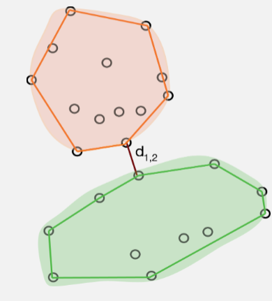

## Clustering

> "Clusters may be described as continuous regions of (a) space containing a relatively high density
of points, separated from other such regions by regions containing a relatively low density of
points." `r tufte::quote_footer('---  Everitt, 1980')`

> "Cluster analysis has the apparently simple aim of finding clusters in a data cloud of sampling units in the absence of any a priori information about which point belongs in which cluster. This apparently unambitious aim is unfortunately fraught with problems."  `r tufte::quote_footer('--- Brian McArdle, STATS302')`


In brief, cluster analysis involves using measures of (dis)similarity and distances to help us define clusters. We use this to uncover hidden or latent clustering by partitioning the data into tighter sets. There are two main methods for doing this: 1) *divisive methods* use nonparametric algorithms (such as k-means) to split data into a small number of clusters, and 2) *agglomerative methods* that cluster cases and/or variables into a hierarchy of sets (e.g., hierarchical clustering). We can use to resampling-based bootstrap methods validate clusters.


### Divisive (partitioning) methods.

For a single run of a partitioning method, the number of clusters ( $k$ ) is typically fixed beforehand. Typically, there are only two steps to  a partitioning method:
  
  1. an initial allocation (usually rather arbitrary) into $k$ preliminary clusters, and then
  2. reallocation of each point either to the closest centroid, or so as to optimise some property of the
clusters. This is repeated until there is no further improvement. 

The initial allocation is usually started by choosing $k$ sampling units to use as *seeds* to
*set* the clusters. There are a number of ways to choose these seeds. These seeds are used as the initial centres of the clusters, points are allocated to the nearest cluster centre, and in most programs the cluster centroid is adjusted as they are added.

#### K-means 

K-means clustering involves defining clusters so that the overall variation within a cluster (known as total within-cluster variation) is minimized. How do we define this variation? Typically, using Euclidean distances; the total within-cluster variation, is in this case, is defined as the sum of squared distances Euclidean distances between observations and the corresponding cluster centroid. 

In summary, the k-means procedure is

+ The number of clusters (k) are specified
+ k objects from the dataset are selected at random and *set* as the initial cluster centers or means
+ Each observation is assigned to their closest centroid (*based on the Euclidean distance between the object and the centroid*)
+ For each of the k clusters the cluster centroid is then updated based on calculating the new mean values of all the data points in the cluster
+ Repeat the two previous steps until 1) the cluster assignments stop changing or 2) the maximum number of iterations is reached

Identifying the appropriate $k$ is important because too many or too few clusters impedes viewing overall trends. Too many clusters can lead to over-fitting (which limits generalizations) while insufficient clusters limits insights into commonality of groups.

There are assorted methodologies to identify the appropriate $k$. Tests range from blunt visual inspections to robust algorithms. The optimal number of clusters is ultimately a **subjective decision**.

### K-means: an example using the `palmerpenguins` data

```{r}

library(palmerpenguins)
## getting rid of NAs
penguins_nafree <- penguins %>% drop_na()
```

```{r}
## introducing a new package GGally, please install
## using install.packages("GGally")
library(GGally)
penguins_nafree %>%
  dplyr::select(species, where(is.numeric)) %>% 
  ggpairs(columns = c("flipper_length_mm", "body_mass_g", 
                     "bill_length_mm", "bill_depth_mm")) 

```

We see that a lot of these variables (e.g., `flipper_length_mm`, `body_mass_g`, and `bill_length_mm`) are relatively strongly (positively) related to one another. Could they actually be telling us the same information? Combined we could think of these three variables all telling us a little about *bigness* of penguin. Is there a way we could reduce these three variables, into say 1, to represent the *bigness* of a penguin. We may not need *all* the information (variation) captured by these variables, but could get away with fewer *new uncorrelated* variables that represent basically the same information (e.g., penguin *bigness*), thereby,  **reducing the dimensionality of the data** (more on this later).

```{r, message = FALSE}
## create a data frame of what we're interested in
df <- penguins_nafree %>%
  dplyr::select(where(is.numeric), -year)
```
We use the `kmeans()` function.

The first argument of `kmeans()` should be the dataset you wish to cluster. Below we use data frame `df`, the penguin data discussed above. But how many clusters do we choose? Let's try 1 to 5... (i.e., using the `centers` argument). Setting `nstart = 25` means that R will try 25 different random starting assignments and then select the best results corresponding to the one with the lowest within cluster variation. 


```{r}
## set the seed so we all start off in the same place
set.seed(4321)
## one cluster
k1 <- kmeans(df, centers = 1, nstart = 25)
## two clusters
k2 <- kmeans(df, centers = 2, nstart = 25)
## three clusters
k3 <- kmeans(df, centers = 3, nstart = 25)
## four clusters
k4 <- kmeans(df, centers = 4, nstart = 25)
## five clusters
k5 <- kmeans(df, centers = 5, nstart = 25)
```


The `kmeans()` function returns a list of components:

+ `cluster`, integers indicating the cluster to which each observation is allocated
+ `centers`, a matrix of cluster centers/means
+ `totss`, the total sum of squares
+ `withinss`, within-cluster sum of squares, one component per cluster
+ `tot.withinss`, total within-cluster sum of squares
+ `betweenss`, between-cluster sum of squares
+ `size`, number of observations in each cluster

#### Choosing the number of clusters

We have an idea there may be 3 clusters, perhaps, but how do we know this is the best fit? Remember it's a **subjective choice** and we'll be looking at a few pointers

**Visual inspection** method

```{r}
library(factoextra) ## a new package for kmeans viz, please install
p1 <- fviz_cluster(k1, data = df)
p2 <- fviz_cluster(k2, data = df)
p3 <- fviz_cluster(k3, data = df)
p4 <- fviz_cluster(k4, data = df)
p5 <- fviz_cluster(k5, data = df)

## for arranging plots
library(patchwork) 
(p1| p2| p3)/ (p4 | p5)
```

Alternatively, you can use standard pairwise scatter plots to illustrate the clusters compared to the original variables.

```{r, echo = TRUE}
df %>%
  mutate(cluster = k3$cluster,
         species = penguins_nafree$species) %>%
  ggplot(aes(flipper_length_mm, bill_depth_mm, color = factor(cluster), label = species)) +
  geom_text()
```

**Elbow** method

Optimal clusters are at the point in which the knee "bends" or in mathematical terms when the marginal total within sum of squares (`tot.withinss`) for an additional cluster begins to decrease at a linear rate

This is easier to see via a plot:

```{r}
fviz_nbclust(df, kmeans, method = "wss") +
  labs(subtitle = "Elbow method")
```

There is a pretty obvious inflection (elbow) at 2 clusters, but maybe at 3 too. We can rule out an optimal number of clusters above 3 as there is then only a  minimal marginal reduction in total within sum of squares. However, the model is ambiguous on whether 2 or 3 clusters is optimal...

**Silhouette** method

```{r}
# Silhouette method
fviz_nbclust(df, kmeans, method = "silhouette")+
  labs(subtitle = "Silhouette method")

```


**Gap** method

```{r}
# Gap statistic
# recommended value: nboot = 500 for your analysis (it will take a while)
set.seed(123) ## remove this
fviz_nbclust(df, kmeans, nstart = 25,  method = "gap_stat", nboot = 50)+
  labs(subtitle = "Gap statistic method")
```


**Basically it's up to you to collate all the suggestions and make and informed decision**

```{r}
## Trying all the cluster indecies AHHHHH
library(NbClust)
cluster_30_indexes <- NbClust(data = df, distance = "euclidean", min.nc = 2, max.nc = 9, method = "complete", index ="all")
fviz_nbclust(cluster_30_indexes) +
      theme_minimal() +
      labs(title = "Frequency of Optimal Clusters using 30 indexes in NbClust Package")
```

Not obvious, basically still undecided between 2 and 3, but according to the absolute majority rule the "best" number is 3


### Hierarchical agglomerative clustering.

Most of the hierarchical methods are agglomerative and they operate in the
same way: 

  1. All sampling units that are zero distance (however this is defined) apart are fused into clusters. 
  2. The threshold for fusion is then raised from zero until two clusters (they may be individual points) are found that are close enough to fuse. 
  3. The threshold is raised, fusing the clusters as their distance apart is reached until all the clusters have been fused into one big one. 
  
So, the close clusters are fused first, then those further apart, till all have been fused. This process allows the history of the fusions, the hierarchy, to be displayed as a dendrogram. This is an advantage of the agglomerative methods, if the data have a nested structure these techniques lead to a useful way of displaying it. 

Unlike the k-means most of the agglomerative techniques can use a broad range of similarity or **distance measures**. This, however, means that considerable care must be taken to choose the appropriate one; different measures often lead to different results.

#### Single linkage (nearest neighbour) clustering.

Single Linkage (*nearest neighbour/minimal jump*): Computes the distance between clusters as the smallest distance between any two points in the two clusters.

<p align="center"></p>

Single Linkage identifies clusters based on how far apart they are at their closest points. This means that if there are any intermediate points then single linkage will fuse the groups without leaving any trace of their separate identities. This is called *chaining* and it often leads to uninformative dendrograms. 

If, however, the clusters are well separated in the data, then single linkage can handle groups of different shapes and sizes easily. In addition, single linkage  will give the same clustering after any monotonic transformation of the distance measure (i.e., it is fairly robust to the choice of measure). 


#### Complete linkage (farthest neighbour) clustering.

Instead of measuring the distance between two clusters as that between their two nearest members **complete Linkage** (*maximum jump*)  uses that between the two farthest members (i.e., it calculates the maximum distance between two points from each cluster.)

<p align = "center"></p>

The resulting clusters are often compact, spherical and well defined. Complete linkage can, however, be sensitive to tied distances. Although, it too, is robust to a certain amount of measurement error and choice of distance. 

#### Group average linkage (UPGMA)

Group average linkage (UPGMA) is probably the most popular hierarchical clustering method! You might like to think of it as an attempt to avoid the extremes of the single and complete linkage methods as the distance between two clusters is the average of the distances between the members of the two groups. As a result this method tends to produce compact spherical clusters.

#### Ward's method (incremental sums of squares, minimum variance, agglomerative sums of squares).

Ward's method is the hierarchical version of the k-means partitioning method. At each fusion it
attempts to minimise the increase in total sum of squared distances within the clusters. This is
equivalent to minimising the sum of squared within cluster deviations from the centroids

<p aligh="center"></p>

Ward's method, at any one stage, can only fuse those clusters already in existence (i.e., it is not
allowed to reallocate points).  A bad start to the agglomeration process can
place the algorithm on a path from which it can never reach the global optimum for a given number
of clusters. Its chief flaw is a tendency to form clusters of equal size, regardless of the true number. Like the complete linkage and group average methods it is also biased towards forming spherical clusters. Despite this, Ward's method performs well in simulations and is often method of choice. 


### Hierarchical clustering: an example
  
**In summary**

  + Start with a matrix of distances, (or similarities) between pairs of observations (cases)
  + Choice of distance measure key first step
  + Algorithm:
      + Initial $n$ singleton clusters
      + Scan distance matrix for two closest individuals, group them together
      + Compute distance from cluster of size 2 to remaining $n-1$ singleton clusters 
      

| Method                 | Pros                   |Cons                   |
|------------------------|------------------------|------------------------|
| Single linkage         | number of clusters     | comb-like trees.        |
| Complete linkage       | compact clusters       | one obs. can alter groups |
| Average linkage        | similar size and variance| not robust             |
| Centroid               | robust to outliers     | smaller number of clusters   |
| Ward                   | minimising an inertia  | clusters small if high variability |


#### Ants

Data were collected on the distribution of ant species at 30 sites across the Auckland region using pitfall traps.  Twenty pitfall traps at each site were left open for ten days and the number of individuals captured counted for the four most abundant species: *Nylanderia spp*, *Pheidole rugosula*, *Tetramorium grassii*, and *Pachycondyla sp*. 

```{r, message = FALSE, warnings = FALSE}
library(tidyverse)
ants <- read_csv("https://raw.githubusercontent.com/STATS-UOA/databunker/master/data/pitfalls.csv")
ants
```


Data are species counts, so we will use Bray Curtis measure:

```{r}
pitfall.dist <- vegan::vegdist(ants[,5:8], method = "bray", binary = FALSE)
factoextra::fviz_dist(pitfall.dist)
```


#### Single-linkage

```{r}
single <- ants[,5:8] %>%
  vegan::vegdist(., method = "bray", binary = FALSE) %>%
  hclust(method = "single")
plot(single, labels = ants$Site)
```

#### Maximum linkage

```{r}
complete <- ants[,5:8] %>%
  vegan::vegdist(., method = "bray", binary = FALSE) %>%
  hclust(method = "complete")
plot(complete, labels = ants$Site)
```

#### Average linkage (UPGMA)

```{r}
average <- ants[,5:8] %>%
  vegan::vegdist(., method = "bray", binary = FALSE) %>%
  hclust(method = "average")
plot(average, labels = ants$Site)
```

#### Ward’s method

```{r}
ward <- ants[,5:8] %>%
  vegan::vegdist(., method = "bray", binary = FALSE) %>%
  hclust(method = "ward.D")
plot(ward, labels = ants$Site)
```


#### WHAT ARE DENDROGRAMS GOOD FOR? *Suggesting clusters for further study...*

Using the function `cutree()` to split into clusters and plot:

```{r}
ants$clust4 <- cutree(ward, k = 4)
library(ape)   ## install
pitfall.phylo <- as.phylo(ward)
pitfall.phylo$tip.label <- ants$Site
## Set colours 
colours  <-  c("red","blue","green","black")
plot(pitfall.phylo, cex = 0.6, tip.color = colours[ants$clust4], label.offset = 0.05) 
```


