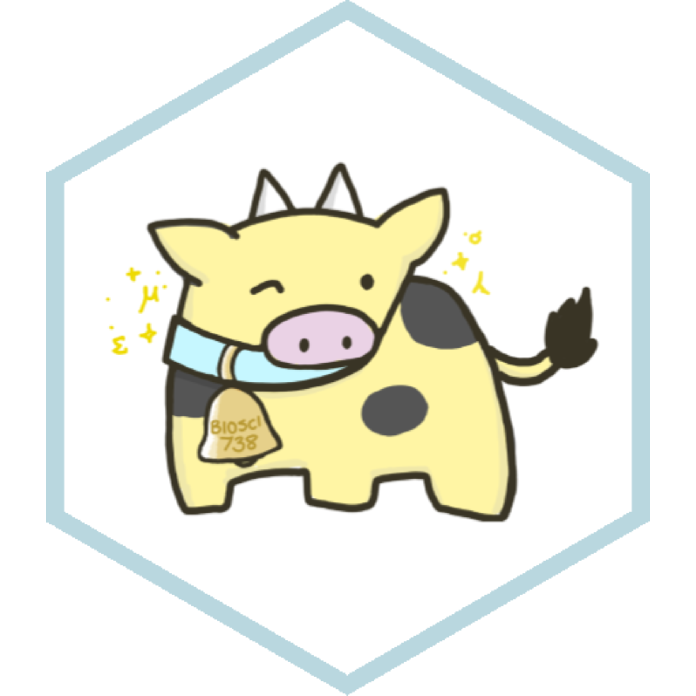

--- 
title: "Advanced Biological Data Analysis"
author: ""
date: ""
---


```{r, include = FALSE}
knitr::opts_chunk$set(message = FALSE, warning = FALSE, collapse = TRUE)
```

# Nau mai, haere mai. Welcome to BIOSCI 738 {-}

<center>{width=60%}</center>

**Lecturer**: [Dr. C. M. Jones-Todd](https://cmjt.github.io/)


**With thanks to Prof. Chris Triggs, Dr Kathy Ruggiero, and Prof. James Russell who all freely gave me their previous iterations of the course and told me to do what I wanted with their notes. I did, and they may well find sections of this material hauntingly familiar! Credit also to all the other fantastic people who've shared materials or have made notes freely available online.  I have endeavored to reference all materials, and more, where appropriate.**

© 2024, Dr. C. M. Jones-Todd