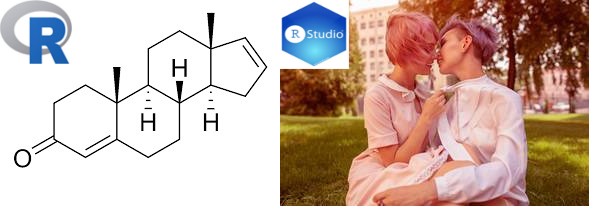

class: inverse, center, middle

```{r xaringan-themer-my, include=FALSE, warning=FALSE}
options(htmltools.dir.version = FALSE,cache = TRUE, warning = FALSE, message = FALSE)
library(xaringanthemer)
style_solarized_light()
```

<style type="text/css">
.remark-slide-content {
    font-size: 20px;
    padding: 1em 4em 1em 4em;
}
</style>


# `R` and `RStudio`

---
class: inverse

# Learning objectives

+ **Define** the difference between `R` and `RStudio`
+ **Explain** what an `R` function is; describe what an argument to an `R` function is
+ **Explain** what an `R` package is; distinguish between the functions `install.packages()` and `library()`
+ **Use** the appropriate `R` function to read in a data file
+ **Explain** the importance of reproducibility in terms of scientific research
+ **Use** the functionality offered by git and GitHub through `RStudio`

---
class:  center

# R is the pheromone to RStudio's PDA.



---
class:  center, middle

# R is the pheromone to RStudio's PDA.

.small[`R` is a language. Specifically a programming language; it's the way you can speak to your computer to ask it to carry out certain computations.

`RStudio` is an integrated development environment (IDE). This means it is basically an interface, albeit a fancy one, that makes it easier to communicate with your computer in the `R` language. The main benefit is the additional features it has that enable you to more efficiently *speak* `R`.

**Note** `R` and `RStudio` are two **different** pieces of software; for this course you are expected to download both. As you'd expect the PDA depends on the pheromones (i.e., `RStudio` depends on `R`) so you have to download `R` to use `RStudio`! ]

---
# Why R? 
#### not an extensive list

--
+ Free

--
+ Open source

--
+ Huge online support network

--
+ Flexible; if you can code it you can do it!

--
+ Reproduciblity


---

# Why RStudio? 
#### not an extensive list

--
+ Works nicely with R

--
+ Huge online support network

--
+ Flexible; so, so, many tools and additions!

--
+ Reproduciblity

---
class: inverse

# Installing R and RStudio

As mentioned above `RStudio` depends on `R` so there is an order you should follow when you download these software.

 1. **Download and install `R`** by following [these instructions](https://cloud.r-project.org/). Make sure you choose the correct operating system.
 
 2. **Download and install `RStudio`** by [going here](https://rstudio.com/products/rstudio/download/) choosing RStudio Desktop *Open Source License* **Free** and following instructions. 
 
---
class: inverse

### Check all is working

  + Open up `RStudio` from your computer menu, the icon will look something like this  (**DO NOT** use this icon  this is a link to `R` and will only open a very basic interface)
  + Wait a little and you should see `RStudio` open up to something similar to the screenshot below
  
     
    
    
  + .small[Pay close attention to the notes in the screenshot and familiarise yourself with the terms.]


---

## R errors  `r emo::ji('scream')`

```{r errors, echo = TRUE, error = TRUE}
data <- read.csv("data_file_not_in_my_working_directory.csv")
library(some_library_I_have_not_installed)
some_function_I_spelled_worng(x = x)
an_object_I_have_not_created
```

---
## Change the `RStudio` appearance up to your taste

Go to **Tools** > **Global Options** > **Apperance**


---
## Good practice: always start with a clean workspace


Go to **Tools** > **Global Options**


---
### Why? So your ex (code) can't come and mess up your life!


---

class: inverse

# Recommened: `.Rproj`
## Project-oriented workflow

+ **Organised** Set up each Each assignment/university course as a *project*
+ **Self-contained** a *project* is a folder that contains all relevant files
   + All paths can then be relative to that *project*
+ **Reproducible** the *project* should just work on a different computer

---

class: inverse

# Recommened: `.Rproj`


Got to **Project** (top right) > **New Project** > **Create Project** 

---
class: inverse

## Project-oriented workflow


---

class: inverse

## `r emo::ji("warning")`Warning`r emo::ji("warning")`

[Jenny Bryan will set your computer on fire](https://www.tidyverse.org/blog/2017/12/workflow-vs-script/) `r emo::ji("fire")` if you start your script like this

```{r fire, echo = TRUE, eval = FALSE}
rm(list = ls())
```

This
+ does **NOT** create a fresh `R` process
+ it makes your script vulnerable
+ ...

---
class: inverse

# Reproducible research

### Keep all similar files for the same analysis in the same place 

### **NEVER** change raw data

---

## Version control


---

## Git and GitHub
#### All workshops will use these tools

+ **Git** the software
  + a version control system
  + manages the evolution of a set of files (tidily)
  + *"Track Changes features from Microsoft Word on steroids"*--- Jenny Bryan

+ **GitHub** an online hosting service
  +  home for your Git-based projects on the internet
  + *"think of it as DropBox but much, much better"* --- Jenny Bryan
  

---

## Setup TL;DR

+ Register an account with GitHub [https://github.com](https://github.com)
+ Make sure you've got the latest version of `R`
```{r version}
R.version.string
```
+ Upgrade `RStudio` to the [new preview version](https://rstudio.com/products/rstudio/download/preview/) (*optional*)
+ Install git: follow [these instructions](https://happygitwithr.com/install-git.html)
+ [Get started](https://happygitwithr.com/hello-git.html)

Resources:

[Happy Git and GitHub for the useR](https://happygitwithr.com/)


---
class: inverse, center, middle

# Exploratory Data Analysis

---
## Starting out with `tidyverse`


Artwork by [@allison_horst](https://github.com/allisonhorst/)

---
## Starting out with `tidyverse`

For EDA we will be using `tidyverse`. ['tidyverse'](https://www.tidyverse.org/) is a collection of `R` packages that all share underlying design philosophy, grammar, and data structures. They are specifically designed to make data wrangling, manipulation, visualisation, and analysis simpler.

To install **all** the packages that belong to the `tidyverse` run

```{r, echo = TRUE, eval = FALSE}
## request (download) the tidyverse packages from the centralised library
install.packages("tidyverse")

```

To tell your computer to access the `tidyverse` functionality in your session run `r library(tidyverse)` (**Note** you'll have to do this each time you start up an `R` session):

```{r, echo = TRUE, eval = TRUE}
## Get the tidyverse packages from our local library
library(tidyverse)

```

---
### Reading in data from a `.csv` file

First off download the `paua.csv` file from CANVAS 

To read the data into `RStudio` 

 1. In the *Environment* pane click **Import Dataset** >  ** From Text (readr)** > **Browse** > *Choose your file, remembering which folder you downloaded it to. this is where `.Rproj` is useful* > *Another pane should pop up, check the data looks as you might expect* > **Import**
 
 
```{r read quiet, echo = FALSE, eval = TRUE, message = FALSE}
paua <- read_csv("../../BIOSCI220/data/paua.csv")
```

2. Or

```{r read demo, echo = TRUE, eval = FALSE, message = FALSE}
paua <- read_csv("paua.csv")
```


---
## Explore your data

Let's have a look at your data in the *Console*

```{r, eval = TRUE, echo = TRUE}
paua
```

---
## Explore your data

Using the `glimpse()` command for an alternative view

```{r, eval = TRUE, echo = TRUE}
glimpse(paua)
```

---
### The pipe operator `%>%`

A nifty `tidyverse` tool is called the pipe operator `%>%`. The pipe operator allows us to combine multiple operations in `R` into a single sequential chain of actions.

Say you would like to perform a hypothetical sequence of operations on a hypothetical data frame x using hypothetical functions f(), g(), and h():

+ Take `x` then
+ Use `x` as an input to a function `f()` then
+ Use the output of this as an input to a function `g()` then
+ Use the output of this as an input to a function `h()`


---

So to calculate the mean **Age** of each **Species** in the `paua` dataset we would use

```{r, eval = TRUE, echo = TRUE}
paua %>%
group_by(Species) %>%
summarize(mean_age = mean(Age))
```

You would read the sequence  above as:

+ Take the `paua` data.frame then
+ Use this and apply the `group_by()` function to group by `Species`
+ Use this output and apply the `summarize()` function to calculate the mean Age of each group (Species), calling the resulting number `mean_age`


---

# Other resources

+ [R for Data Science](https://r4ds.had.co.nz/)
+ [RStudio Education](https://education.rstudio.com/learn/beginner/)
+ [An Introduction to R](https://intro2r.com/)
+ [Learning statistics with R: A tutorial for psychology students and other beginners](https://learningstatisticswithr.com/lsr-0.6.pdf)
+ [R for Biologists](https://www.rforbiologists.org/)
+ [Quantitative Biology: Basic Introduction to R](http://phylo.wikidot.com/biosci220:quantitative-biology)


---

# Enjoy


Artwork by [@allison_horst](https://github.com/allisonhorst/)


---
class: inverse, center, middle

# Data wrangling and visualisation

---
class: inverse

# Learning objectives

+ **Define** data sovereignty and **explain** this in relation to a researcher's obligation when collecting, displaying, and analysing data
+ **Discuss**the ethics of data vizualisation
+ **Create** and **communicate** informative data visualisations using `R`
+ **Discuss** and **critique** data visualisations
+ **Carry out**, and **interpret** the outputs of, basic exploratory data analysis using in-built R functions

---
class: middle

### [''**Data sovereignty** is the idea that data are subject to the laws and governance structures within the nation it is collected''](https://en.wikipedia.org/wiki/Data_sovereignty)

### Recearcher's obligations?

`r countdown::countdown(minutes = 5, font_size = "48px", top = 0)`


Resources: 

+ [Why data sovereignty matters](https://www.onenet.co.nz/our-resources/why-data-sovereignty-matters/)
+ [Indigenous Data Sovereignty and Policy](https://library.oapen.org/handle/20.500.12657/42782)
+ [Principles of Māori Data Sovereignty](https://cdn.auckland.ac.nz/assets/psych/about/our-research/documents/TMR%2BM%C4%81ori%2BData%2BSovereignty%2BPrinciples%2BOct%2B2018.pdf)

---
## Data Viz

> "...have obligations in that we have a great deal of power over how people 
> ultimately make use of data, both in the patterns they see and the conclusions they draw."

> `r tufte::quote_footer('--- Michael Correll, Ethical Dimensions of Visualization Research')`

> "Clutter and confusion are not attributes of data - they are shortcomings of design."

> `r tufte::quote_footer('--- Edward Tufte')`
---

## Plot types...

--

+ **For you**
  + data exploration
  + doesn't have to look pretty
  + just needs to get to the point


+ **For others**
 + clear purpose
 + designed for the audience
 + make it easy to read (*this covers a lot of things*)
 + do not distort
 

.footnote[[Interesting blogs on graphs in the media](https://www.statschat.org.nz/?s=graphs)]

---

### Does not *spark joy*


.footnote[[Awful graphs about interesting data](https://www.statschat.org.nz/2015/03/18/awful-graphs-about-interesting-data/) & [3d bar graphs: just say no](https://www.statschat.org.nz/2013/07/30/3d-bar-graphs-just-say-no/)]
---
class: inverse

## `ggplot2`

`ggplot2` is an `R` package for producing statistical, or data, graphics; it has an underlying grammar based on the [Grammar of Graphics](https://www.amazon.com/Grammar-Graphics-Statistics-Computing/dp/0387245448)

Every `ggplot2` plot has three key components:

  + `data`,

  + A set of `aes`thetic mappings between variables in the data and visual properties, and

  + At least one layer which describes how to render each observation. Layers are usually created with a `geom` function.


Resources:

+ [`ggplot2` cheatsheet](https://rstudio.com/wp-content/uploads/2016/11/ggplot2-cheatsheet-2.1.pdf)
+ [Elegant Graphics for Data Analysis](https://ggplot2-book.org/introduction.html)
+ [Using `ggplot2` to communicate your results](https://ourcodingclub.github.io/tutorials/datavis/)

---

### `ggplot2` layers


---

# Example

```{r penguins}
library(palmerpenguins) ## contains some nice penguin data
library(ggplot2) ## for plotting
penguins

```

---


```{r flip, echo = FALSE}
library(flipbookr)
xaringanExtra::use_panelset()
options(warn = -1)
```


```{r flippoint, echo = FALSE, include = FALSE,message=FALSE,warning=FALSE}
ggplot(penguins,aes(x = body_mass_g, y = flipper_length_mm)) + ## data & aesthetics
    geom_point() + ## geom
  geom_smooth(method = 'lm', se = FALSE) ## statistics (linear regression line)
```

`r chunk_reveal("flippoint", title = "## Example: scatter plot")`

---

```{r flipbox2, echo = FALSE, include = FALSE,message=FALSE,warning=FALSE}
ggplot(penguins,aes(x = species, y = flipper_length_mm)) + ## data & aesthetics
    geom_boxplot()  + ## geom
  ggtitle("Flipper length (mm) by species") +
  ylab("Flipper length (mm)") +
  xlab("Species") +
  theme_dark() ## theme
```

`r chunk_reveal("flipbox2", title = "## Example: boxplot and theme")`

---
```{r flippoint2, echo = FALSE, include = FALSE,message=FALSE,warning=FALSE}
ggplot(penguins,aes(x = body_mass_g, y = flipper_length_mm, color = species)) + ## data and aesthetics
    geom_point() + ## geom
  geom_smooth(method = 'lm', se = FALSE) ## statistic (linear regression line without intervals)
```

`r chunk_reveal("flippoint2", title = "## Example: scatter plot by species")`

---
class: inverse, center, middle

## Live demo

---
class: inverse

### The Good, the Bad, and the Ugly...

.panelset[
 .panel[.panel-name[Boxplot]
 
```{r boxes, echo = FALSE,results='asis'}
ggplot(penguins,aes(x = species, y = flipper_length_mm)) + ## data & aesthetics
    geom_boxplot()  + ## geom
  ggtitle("Flipper length (mm) by species") +
  ylab("Flipper length (mm)") +
  xlab("Species") +
  theme_dark() ## theme

```
]
.panel[.panel-name[Scatter plot (jittered)]

```{r jboxes, echo = FALSE,results='asis'}
ggplot(penguins,aes(x = species, y = flipper_length_mm)) + ## data & aesthetics
    geom_jitter()  + ## geom
  ggtitle("Flipper length (mm) by species") +
  ylab("Flipper length (mm)") +
  xlab("Species") +
  theme_dark() ## theme

```
]
.panel[.panel-name[Violin plot]

```{r vboxes, echo = FALSE,results='asis'}
ggplot(penguins,aes(x = species, y = flipper_length_mm)) + ## data & aesthetics
    geom_violin()  + ## geom
  ggtitle("Flipper length (mm) by species") +
  ylab("Flipper length (mm)") +
  xlab("Species") +
  theme_dark() ## theme

```
]
.panel[.panel-name[Code]
```{r boxesc, eval = FALSE}
box <- ggplot(penguins,aes(x = species, y = flipper_length_mm)) + ## data & aesthetics
    geom_boxplot()  + ## geom
  ggtitle("Flipper length (mm) by species") +
  ylab("Flipper length (mm)") +
  xlab("Species") +
  theme_dark() ## theme
jitter <- ggplot(penguins,aes(x = species, y = flipper_length_mm)) + ## data & aesthetics
    geom_jitter()  + ## geom
  ggtitle("Flipper length (mm) by species") +
  ylab("Flipper length (mm)") +
  xlab("Species") +
  theme_dark() ## theme
violin <- ggplot(penguins,aes(x = species, y = flipper_length_mm)) + ## data & aesthetics
    geom_violin()  + ## geom
  ggtitle("Flipper length (mm) by species") +
  ylab("Flipper length (mm)") +
  xlab("Species") +
  theme_dark() ## theme
```
]
]

---
class: inverse

.panelset[
 .panel[.panel-name[Plot 1]
```{r simple, echo = FALSE,warning=FALSE,results='asis'}
ggplot(penguins, aes(x = body_mass_g, y = flipper_length_mm)) +
    geom_point() +
    geom_smooth(method = "lm", col = "blue", se = FALSE)
```
]
.panel[.panel-name[Plot 1 code]
```{r simplec, eval = FALSE}
ggplot(penguins, aes(x = body_mass_g, y = flipper_length_mm)) +
    geom_point() +
    geom_smooth(method = "lm", col = "blue", se = FALSE)
```
]
.panel[.panel-name[Plot 2]
```{r facet, echo = FALSE,warning=FALSE}
ggplot(penguins, aes(x = body_mass_g, y = flipper_length_mm, 
                         col = species)) +
    geom_point(size = 2, alpha = 0.5) + 
    geom_smooth(method = "lm", se = FALSE) +
    facet_grid(~ sex) +
    theme_bw() + 
    labs(title = "Flipper Length and Body Mass, by Sex & Species",
         subtitle = paste0(nrow(penguins), " of the Palmer Penguins"),
         x = "Body Mass (g)", 
         y = "Flipper Length (mm)")
```
]
.panel[.panel-name[Plot 2 code]
```{r facetc, eval = FALSE}
ggplot(penguins, aes(x = body_mass_g, y = flipper_length_mm, 
                         col = species)) +
    geom_point(size = 2, alpha = 0.5) + 
    geom_smooth(method = "lm", se = FALSE) +
    facet_grid(~ sex) +
    theme_bw() + 
    labs(title = "Flipper Length and Body Mass, by Sex & Species",
         subtitle = paste0(nrow(penguins), " of the Palmer Penguins"),
         x = "Body Mass (g)", 
         y = "Flipper Length (mm)")
```
]
.panel[.panel-name[Plot 3]
```{r facetna, echo = FALSE,warning=FALSE}
penguins_nafree <- penguins %>% drop_na()
ggplot(penguins_nafree, aes(x = body_mass_g, y = flipper_length_mm, 
                         col = species)) +
    geom_point(size = 2, alpha = 0.5) + 
    geom_smooth(method = "lm", se = FALSE) +
    facet_grid(~ sex) +
    theme_bw() + 
    labs(title = "Flipper Length and Body Mass, by Sex & Species",
         subtitle = paste0(nrow(penguins_nafree), " of the Palmer Penguins"),
         x = "Body Mass (g)", 
         y = "Flipper Length (mm)")
```
]
.panel[.panel-name[Plot 3 code]
```{r facetnac, eval = FALSE}
penguins_nafree <- penguins %>% drop_na()
ggplot(penguins_nafree, aes(x = body_mass_g, y = flipper_length_mm, 
                         col = species)) +
    geom_point(size = 2, alpha = 0.5) + 
    geom_smooth(method = "lm", se = FALSE) +
    facet_grid(~ sex) +
    theme_bw() + 
    labs(title = "Flipper Length and Body Mass, by Sex & Species",
         subtitle = paste0(nrow(penguins), " of the Palmer Penguins"),
         x = "Body Mass (g)", 
         y = "Flipper Length (mm)")
```
]
]


---
class: center, middle

## The Good, the Bad, and the Ugly...

### Reflections.
### Improvements? Additions?
### What do these plots suggest?

`r countdown::countdown(minutes = 3, font_size = "48px", top = 0)`


---

class: center, middle

## Common dataframe manipulations in the `tidyverse`

### Using `dplyr` and `tidyr`

```{r iframe, echo = FALSE}
knitr::include_url("https://dplyr.tidyverse.org/", height = "400px")
```


---
background-image: url("https://raw.githubusercontent.com/allisonhorst/stats-illustrations/master/rstats-artwork/tidydata_1.jpg")
background-size: contain

# `tidy` data

.footnote[background image: illustrations from the Openscapes blog [Tidy Data for reproducibility, efficiency, and collaboration](https://www.openscapes.org/blog/2020/10/12/tidy-data/) by Julia Lowndes and Allison Horst]

---
### Removing NA values

```{r}
penguins_nafree <- penguins %>% drop_na()
penguins_nafree
```

---
### Extract rows that meet logical criteria

```{r}
dplyr::filter(penguins_nafree, island == "Torgersen" )
```

---

### Summarise data into single row of values

```{r}
dplyr::summarise(penguins_nafree, avgerage_bill_length = mean(bill_length_mm))
```

---

### Group data into rows with the same value of Species


```{r}
dplyr::group_by(penguins_nafree, species)
```

---

### Compute separate summary row for each group

```{r}
penguins_nafree %>% 
  group_by(species) %>% 
  summarise(avgerage_bill_length = mean(bill_length_mm))
```

---

### Compute separate summary row for each group

```{r}
penguins_nafree %>% 
  group_by(island,species) %>% 
  summarise(avgerage_bill_length = mean(bill_length_mm))
```


---
class: inverse, center, middle

## Back to plots; they are more than just pretty.

### The average values are all well and good... but... variation?

#### within... between... what does it all mean.

---
class: center
```{r, echo = FALSE}
ggplot(penguins_nafree,aes(x = species, y = bill_length_mm)) + 
    geom_violin()  + 
  ylab("Bill length (mm)") +
  xlab("Species")
```


---
class: center
```{r, echo = FALSE}
means <- penguins_nafree %>% group_by(species) %>% summarise(means = mean(bill_length_mm))
ggplot(penguins_nafree,aes(x = species, y = bill_length_mm)) + 
    geom_violin()  + 
  ylab("Bill length (mm)") +
  xlab("Species") +
  geom_point(data = means, aes(x = species, y = means),color = "blue", size = 2) +
  geom_hline(data = means, aes(yintercept = means), color = "blue", alpha = 0.3, lty = 2) + 
annotate(geom = 'text', label = "Average bill length per species" , x = -Inf, y = Inf, hjust = 0, vjust = 1.2, color = "blue")
```


---
class: center
```{r, echo = FALSE}
means <- penguins_nafree %>% group_by(species) %>% summarise(means = mean(bill_length_mm))
mean <- mean(penguins_nafree$bill_length_mm)
ggplot(penguins_nafree,aes(x = species, y = bill_length_mm)) + 
    geom_violin()  + 
  ylab("Bill length (mm)") +
  xlab("Species") +
   geom_point(data = means, aes(x = species, y = means),color = "blue", size = 2) +
annotate(geom = 'text', label = "Average bill length per species" , x = -Inf, y = Inf, hjust = 0, vjust = 1.2, color = "blue") +
  geom_hline(data = means, aes(yintercept = means), color = "blue", alpha = 0.3, lty = 2) + 
  geom_hline(yintercept = mean, color = "red") +
  annotate(geom = 'text', label = "Overall average bill length" , x = -Inf, y = Inf, hjust = 0, vjust = 3, color = "red")
```

---
class: center
```{r, echo = FALSE}
means <- penguins_nafree %>% group_by(species) %>% summarise(means = mean(bill_length_mm))
mean <- mean(penguins_nafree$bill_length_mm)
means$ends <- mean
ggplot(penguins_nafree,aes(x = species, y = bill_length_mm)) + 
    geom_violin()  + 
  ylab("Bill length (mm)") +
  xlab("Species") +
   geom_point(data = means, aes(x = species, y = means),color = "blue", size = 2) +
annotate(geom = 'text', label = "Average bill length per species" , x = -Inf, y = Inf, hjust = 0, vjust = 1.2, color = "blue") +
  geom_hline(data = means, aes(yintercept = means), color = "blue", alpha = 0.3, lty = 2) + 
  geom_hline(yintercept = mean, color = "red") +
  annotate(geom = 'text', label = "Overall average bill length" , x = -Inf, y = Inf, hjust = 0, vjust = 3, color = "red") +
  geom_segment(data = means, aes(x = species, y = means, xend = species, yend = ends),col = "darkgreen", size = 2)  +
  annotate(geom = 'text', label = "Differences to overall average" , x = -Inf, y = Inf, hjust = 0, vjust = 5, color = "darkgreen")
```

---
class: center

```{r, echo = FALSE}
means <- penguins_nafree %>% group_by(species) %>% summarise(means = mean(bill_length_mm))
mean <- mean(penguins_nafree$bill_length_mm)
means$ends <- mean
means$lag1 <- means$means[c(2,3,1)]
means$lag2 <- means$means[c(3,1,2)]
ggplot(penguins_nafree,aes(x = species, y = bill_length_mm)) + 
    geom_violin()  + 
  ylab("Bill length (mm)") +
  xlab("Species") +
   geom_point(data = means, aes(x = species, y = means),color = "blue", size = 2) +
annotate(geom = 'text', label = "Average bill length per species" , x = -Inf, y = Inf, hjust = 0, vjust = 1.2, color = "blue") +
  geom_hline(yintercept = mean, color = "red") +
  annotate(geom = 'text', label = "Overall average bill length" , x = -Inf, y = Inf, hjust = 0, vjust = 3, color = "red") +
  geom_segment(data = means, aes(x = species, y = means, xend = species, yend = ends),col = "darkgreen", size = 1)  +
  annotate(geom = 'text', label = "Differences to overall average" , x = -Inf, y = Inf, hjust = 0, vjust = 5, color = "darkgreen") +
  geom_hline(data = means, aes(yintercept = means), color = "blue", alpha = 0.3, lty = 2) + 
  geom_segment(data = means, aes(x = as.numeric(species) - 0.15, y = means, 
                                 xend = as.numeric(species) - 0.15, yend = lag1),col = "purple", size = 2) +
  geom_segment(data = means, aes(x = as.numeric(species) + 0.15, y = means, 
                                 xend = as.numeric(species) + 0.15, yend = lag2),col = "purple", size = 2)+
  annotate(geom = 'text', label = "Differences between groups" , x = -Inf, y = Inf, 
           hjust = 0, vjust = 7, color = "purple")
```

---

class: inverse, center, middle

## Thoughts?

`r countdown::countdown(minutes = 2, font_size = "48px", top = 0)`