#  Recall terms 

+ In the first part of the course we are comparing Treatments .
	+ Treatments are indexed by Factors , e.g. Surgery 
	+ The levels of Surgery are the three different types of operation which are carried out; Sham (= Control), Pancreatitis, and Shock
		+ Not a continuous, or even ordered, variable.


---
#  Recall terms 

+ The Experimental unit is the smallest piece of experimental material which could receive a different level of Surgery
	+ The experimental unit is the rat
		+ A rat can only experience one type of surgery.
	+ The  Observational unit  is the smallest piece of experimental material on which a measurement is made
	+ In this case the observational unit is the rat
		+ We make one measurement of AUC on each rat.


---
#  Recall terms 

+ Experimental unit =  Observational unit  = rat
	+ On each observational unit we make a measurement
		+ which has its own unit of measurement, e.g. mm, 0 C,  mg/ml


---


```{r tbl4, echo = FALSE}
tbl4 <- tibble::tribble(
~`Surgery`, ~`Rat`, ~`AUC`, ~`logAUC`,
"C","1","4865.9","8.49",
"C","4","3641.0","8.20",
"C","6","8778.0","9.08",
"C","9","3197.1","8.07",
"P","2","28001.1","10.24",
"P","3","2253.0","7.72",
"P","8","11384.4","9.34",
"P","10","4914.8","8.50",
"S","5","81633.9","11.31",
"S","7","324486.8","12.69",
"S","11","86681.9","11.37",
"S","12","50011.1","10.82"
)

kableExtra::kable_styling(knitr::kable(tbl4), font_size = 18)
```


---
#  Analysis of a CRD 

One-way ANOVA
+ Can fit in two ways in R
	+ Use lm()  or aov () function, i.e.
	+ Both generate the same ANOVA table!!!!
	+ What conclusions can we draw from this?
lm ( logAUC  ~ Surgery, data= crd.df )
aov ( logAUC  ~ Surgery, data= crd.df )
 Df  Sum Sq Mean Sq F value Pr (>F)
Surgery      2 22.026  11.013   16.36 0.00101 **
Residuals    9  6.059   0.673
---
Signif . codes:  0 ‘***’ 0.001 ‘**’ 0.01 ‘*’ 0.05 ‘.’ 0.1 ‘ ’ 1


---
#  Analysis of a CRD 

When carrying out a one-way ANOVA…
+ We are testing the null hypothesis
H 0 :	The population (Surgery) means are the same
against the alternative hypothesis
H A :	At least one population mean differs from the 		others
+ The p-value
Pr (>F )  =  0.00101 < 0.01
tells we have sufficient evidence to reject H 0 at the 1% level of significance


---
#  Analysis of a CRD 

Which pairs of means are different?
+ Pair-wise comparisons of means
	+ Use two-sample t -tests
	+ We need to calculate our observed  t -value
where
= Difference between pair of sample means
+ Compute the p -value for observed t -value


---
#  Analysis of a CRD 

One-way ANOVA with lm ()
> summary ( crd.lm )$ coef
Estimate Std. Error    t value Pr (>|t|)
(Intercept)   8.4600  0.4102531 20.6214144 6.930903e-09
SurgeryP 0.4900  0.5801856  0.8445574 4.202408e-01
SurgeryS 3.0875  0.5801856  5.3215734 4.799872e-04
+ Values of Estimate  and  Std.  Error
	+ (Intercept) = mean C  8.46
	+ SE of (Intercept) = SE of mean C = SEM             0.41
	+ SurgeryP  = mean P – mean C 0.49
	+ SE of SurgeryP  = SE of ( mean P – mean C ) = SED   0.58


---
#  Analysis of a CRD 

One-way ANOVA with lm ()
> summary ( crd.lm )$ coef
Estimate Std. Error    t value Pr (>|t|)
(Intercept)   8.4600  0.4102531 20.6214144 6.930903e-09
SurgeryP 0.4900  0.5801856  0.8445574 4.202408e-01
SurgeryS 3.0875  0.5801856  5.3215734 4.799872e-04
+ And the t value and Pr (>|t|) are the t - and p-value for testing the null hypotheses:
	+ Mean abundance is zero for C population
	+ No difference between the population means of P and C
	+ No difference between the population means of S and C
We’re interested in 2 and 3, but not 1!!!

---
#  Analysis of a CRD 

One-way ANOVA with lm ()
> summary ( crd.lm )$ coef
Estimate Std. Error    t value Pr (>|t|)
(Intercept)   8.4600  0.4102531 20.6214144 6.930903e-09
SurgeryP 0.4900  0.5801856  0.8445574 4.202408e-01
SurgeryS 3.0875  0.5801856  5.3215734 4.799872e-04
+ Two-sample t -tests for pairwise comparisons of means
	+ SurgeryP :
t value = Estimate ÷ Std . Error =  0.8446
Pr (>|t|) =  0.4202
+ Cannot get t - or p -value of mean P – mean S directly from table

---
#  Analysis of a CRD 

Estimation of s 2
+ Some notation:
	+ (read “sigma-squared”) denotes the population variance
	+ s 2 denotes the sample variance, i.e. is estimated from dataset
	+ A hat (^) above a maths symbol means an “ estimated value ”
	+ So, what is the value of ?
 Df  Sum Sq Mean Sq F value Pr (>F)
Surgery      2 22.026  11.013   16.36 0.00101 **
Residuals    9  6.059   0.673
---
Signif . codes:  0 ‘***’ 0.001 ‘**’ 0.01 ‘*’ 0.05 ‘.’ 0.1 ‘ ’ 1
 =  0.673

---
#  Analysis of a CRD 

Standard Error of the Mean, SEM, Error of the Difference between two means, SED
+ What is the difference?
	+ From Analysis of Variance Table:
		+ SEM =  ( is the group replication)
		+ SED =  (only true for equi -replicated groups)

```{r tbl12, echo = FALSE}
tbl12 <- tibble::tribble(
~`Group`, ~`Mean`, ~`Standard Errors`, ~` `,
" "," ","SEM","SED",
"C ontrol","8.460","0.4103","0.5801",
"P ancreatitis","8.950","0.4103","0.5801",
"S hock","11.547","0.4103","0.5801"
)

kableExtra::kable_styling(knitr::kable(tbl12), font_size = 18)
```

---
#  Analysis of a CRD 

Means, SEMs and SEDs from one-way ANOVA
+ There’s an easier way!!!
	+ Use package predictmeans
		+ Available on CRAN
		+ You will need to install it and then load it
			+ See details in Workshop 2

---
#  Analysis of a CRD 

Using the predictmeans package
# Load predictmeans (assumes already installed)
> library( predictmeans )
> predictmeans ( crd.lm , modelterm ="Surgery",
pairwise=TRUE , adj.by ="none")
There is no plot for p-values matrix less than six values!
$`Predicted Means`
Surgery
C       P       S
8.4600  8.9500 11.5475
$`Standard Error of Means`
All means have the same Stder 
0.41025

---
#  Analysis of a CRD 

From predictmeans package
$`Predicted Means`
Surgery
C       P       S
8.4600  8.9500 11.5475
From crd.lm output
Call: lm(formula = logAUC ~ Surgery, data = crd.df )
Coefficients :
( Intercept) SurgeryP  SurgeryS 
 8.460    0.490    3.087
SurgeryP = P mean – C mean 		0.490 = 8.9500 – 8.4600
SurgeryS = S mean – C mean 		3.087 = 11.5475 – 8.4600
What about the difference between SurgeryS and Surgery P?
S mean – P mean       = 11.5475 – 8.9500  =   2.5975
SurgeryS – SurgeryP =   3.087 – 0.490    =   2.597

---
#  Analysis of a CRD 

Using the predictmeans  package
# More output...
$` Standard Error of Differences`
 Max.SED  Min.SED  Aveg.SED 
0.58019  0.58019  0.58019
$LSD
[1] 1.312481
attr (,"Significant level")
[1] 0.05
attr (,"Degree of freedom")
[1] 9
All the same, - each level of Treatment factor, Surgery,  has the same replication

---
#  Analysis of a CRD 

Using the predictmeans  package
# Still more output...
$`Pairwise LSDs`
C        P       S
C 0.00000 -0.49000 -3.0875
P 1.31247 0.00000 -2.5975
S 1.31247  1.31247 0.0000
attr (,"Significant level")
[1] 0.05
attr (,"Degree of freedom")
[1] 9
attr (,"Note")
[1] "LSDs matrix has mean differences (row-col) above the diagonal , LSDs below the diagonal "

---
#  Analysis of a CRD 

Using the predictmeans  package
# And still more output...
$`Pairwise p-values`
C       P       S
C 1.0000 -0.8446  -5.3216
P 0.4202 1.0000 -4.4770
S 0.0005  0.0015 1.0000
attr (,"Degree of freedom")
[1] 9
attr (,"Note")
[1] "p-values matrix has t-values above the diagonal , p-values (adjusted by ‘none’ method) below the diagonal"

---
#  Top of bar = Mean 

Error bars =  1 x SE
Analysis of a CRD
A common summary table used by biologists
A common graph used by biologists “ dynamite plot ”
What do you think of these?

```{r tbl19, echo = FALSE}
tbl19 <- tibble::tribble(
~`Group`, ~`Mean`, ~`SE`, ~`t`, ~`p`,
"C ontrol","8.460","0.225","-0.845","0.4202",
"P ancreatitis","8.950","0.542","-5.322","0.0005",
"S hock","11.547","0.400","-4.477","0.0015"
)

kableExtra::kable_styling(knitr::kable(tbl19), font_size = 18)
```
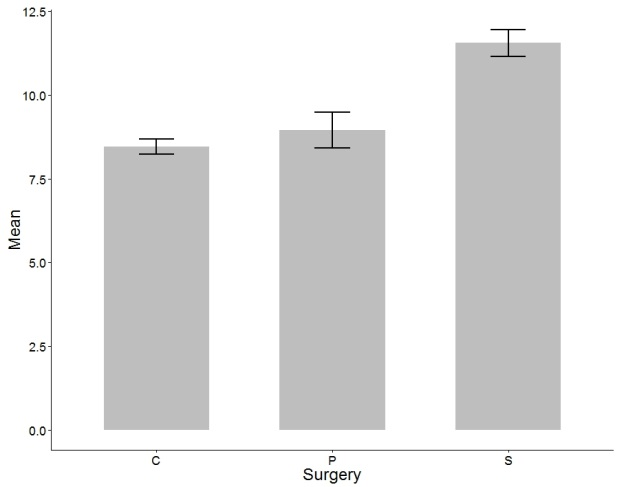

---
#  Analysis of a CRD 

A better visual summary using Mean ± 2SEs
Why error bars that are ± twice the SE?
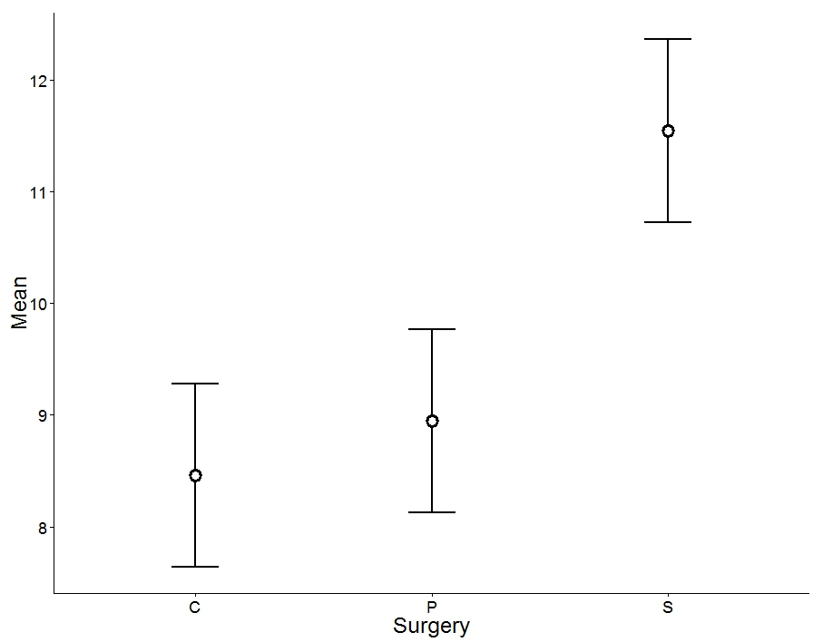

---
#  Analysis of a CRD: Mean ± 2SEs 

+ This is approx. the 95% confidence interval for the population mean
	+ The exact 95% CI is given by
Mean  t df,1/2  SEM
 ( df = degrees of freedom;  = level of significance)
+ Each mean has its own confidence interval whose width depends on the SEM for that mean
	+ When the df are large (e.g. 30 or greater) and  = 0.05 t df,1 /2 = t large,0.975 ≈ 2
	+ Hence, the 95% confidence interval for the population mean is approximately Mean ± 2  SEM

---
#  Analysis of a CRD 

95% CI for the Control group mean
t df,1/ 2 = t 9,10.05/2 = 2.262
(In R use qt (0.975, 9 ) )
LSD = t 9,1 0.05/2   SED = 2.262    0.41025
95% CI: 8.460 ± 0.928 = ( 7.532, 9.388)
Use the table below to calculate the 95% CIs

```{r tbl22, echo = FALSE}
tbl22 <- tibble::tribble(
~`Group`, ~`Mean`, ~`SE`, ~`t`, ~`p`,
"C ontrol","8.460","0.225","-0.845","0.4202",
"P ancreatitis","8.950","0.542","-5.322","0.0005",
"S hock","11.547","0.400","-4.477","0.0015"
)

kableExtra::kable_styling(knitr::kable(tbl22), font_size = 18)
```

---
#  Analysis of a CRD 

The Least significant difference, LSD
+ See Welham et al. Section 4.4.1, pages 84 – 88.
	+ The LSD = t df,1/2  SED
		+ The SED is the S tandard E rror of the D ifference (of a pair of means).
		+ When the two means have the same replication SED = x SEM
	+  When a pair of means differ by more than  the LSD, we say:
“ Their difference is statistically significant at the 100  % level .”

---
#  Analysis of a CRD 

Plot of Mean ± LSD
Which means are significantly different?


---
#  Analysis of a CRD 

Alternatively, plot means with an LSD bar
Generated by predictmeans ()
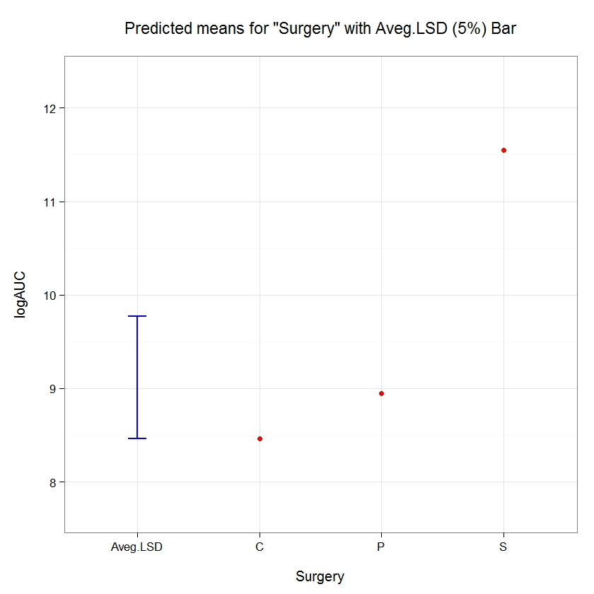

---


---
#  Key assumptions of Analysis of Variance 

+ Observations are independent
	+ Check experiment description.
	+ How were data collected?
	+ All observations have the same variance
	+ Spread of the observations does not depend on the Treatment Mean
	+ All observations are (approximately) normally distributed.

---
#  Example: CRD 

Side-by-side boxplots of Raw  AUC data
+ Shows variability in AUC increases with mean AUC
ggplot ( crd.df , aes (x = Surgery, y = AUC)) +
 geom_boxplot () +
 geom_dotplot ( binaxis  = "y", stackdir = " center ", dotsize = 0.75) +
 theme_bw ()


---
#  Example: CRD 

Take logs
+ Shows variability in AUC not related with mean logAUC
ggplot ( crd.df , aes (x = Surgery, y = logAUC )) + geom_boxplot ()


---
#  Residual plot to evaluate homogeneity of variances assumption 

+ Plot residuals against the estimated values of the treatment means (Predicted Values)
	+ If the variability of the observations around the treatment means differs between groups, this will be reflected in the residual plot

---
#  Example: Completely Randomised Design, CRD 

Extract the residuals and predicted values
+ First, fit the linear model for a CRD in R
	+ Conclusion?
> crd.lm <- lm(AUC ~ Surgery, data = AUC.df )
> anova ( crd.lm )
Analysis of Variance Table
Response: AUC
 Df Sum Sq Mean Sq F value Pr (>F)
Surgery    2 4.3315e+10 2.1658e+10       4 0.05716 .
Residuals  9 4.8729e+10 5.4144e+09
---
Signif . codes:  0 ‘***’ 0.001 ‘**’ 0.01 ‘*’ 0.05 ‘.’ 0.1 ‘ ’ 1

---
#  Example: CRD 

Extract the residuals and predicted values
> # Extract residuals and add to crd.df
> crd.df$Residuals <- residuals( crd.lm )
>
> # Extract predicted (fitted) values and add to crd.df
> crd.df$Fitted.Values  <- fitted.values ( crd.lm )
>
> # Print first few rows of crd.df
> head( crd.df )
 Surgery Rat        AUC   Residuals Fitted.Values
1        C   1   4865.866   -254.6050      5120.471
2        C   2   3640.950  -1479.5208      5120.471
3        C   3   8777.966   3657.4950      5120.471
4        C   4   3197.102  -1923.3692      5120.471
5        P   1  28001.126  16362.8103     11638.316
6        P   2   2252.960  -9385.3561     11638.316

---
#  Example: CRD 

Plot Residuals versus Fitted.Values
ggplot ( crd.df , aes (x = Fitted.Values , y = Residuals)) +
 theme_bw () +  # Suppress grey background
 geom_point (size = 4, shape = 18)  # Increase size plotting symbol
 # Change plotting symbol
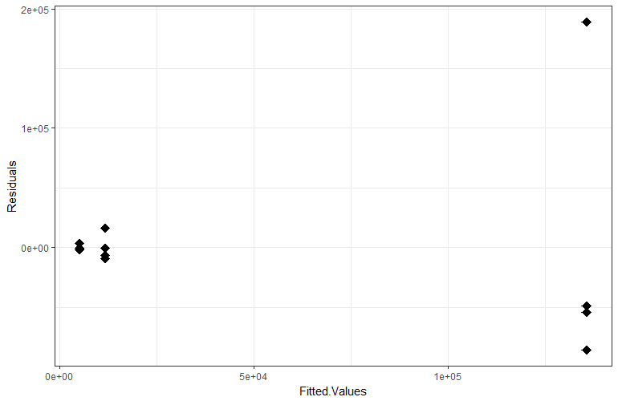

---
#  Example: CRD: Plot Residuals versus Fitted.Values 

ggplot ( crd.df , aes (x = Fitted.Values , y = Residuals)) +
 theme_bw () + # Suppress grey background
 geom_hline ( yintercept = 0, col = 2, size = 2)  +
# add horizontal line at zero, coloured red, width = 2
 geom_point (size = 4, shape = 18)  # Increase size plotting symbol
  # Change plotting symbol
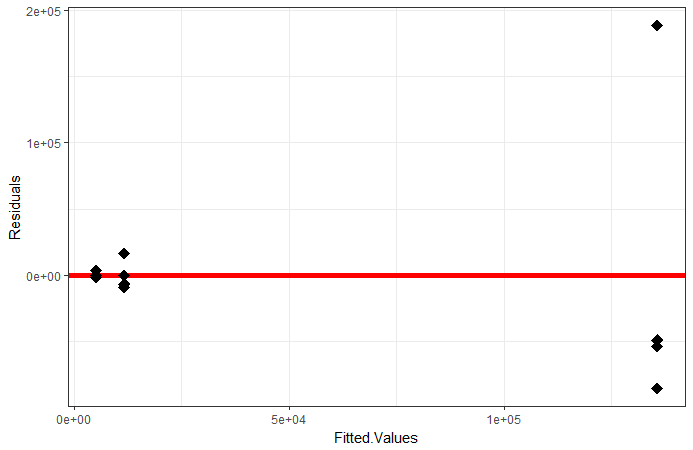

---
#  Is homogeneity of variance assumption satisfied? 

Plot Residuals versus Fitted values
Residuals increase in variability with predicted mean values
Slide
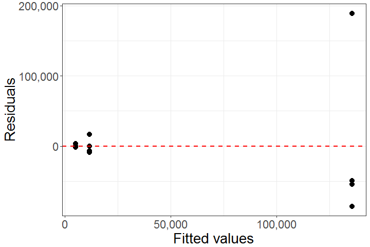

---
#  Plot Residuals versus Fitted.Values 

ggplot ( AUC.df , aes (x = Fitted.Values , y = Residuals)) +
 theme_bw () +                       # Suppress grey background
 geom_hline ( yintercept = 0, col = 2, size = 2)  +
# add horizontal line at zero, coloured red, width = 2
 geom_point (size = 4, shape = 18)  + # Increase size plotting symbol
# Change plotting symbol
 geom_abline ( intercept = 0, slope = +1.5, col = 4, linetype = 2 ,size = 2) +
 geom_abline ( intercept = 0, slope = -1.5, col = 4, linetype = 2 ,size = 2)
# add dashed lines to show spread
Residuals increase in variability with increases in the mean
Conclusion: Equal Variance assumption violated
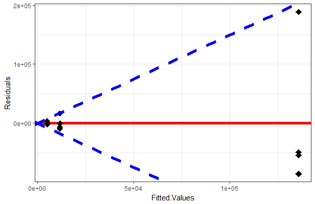

---
#  Example: CRD 

Probability plot to evaluate normality assumption
+ Normal quantile-quantile (QQ) plot
	+ Plot sorted residuals versus expected order statistics from a standard normal distribution
		+ Samples should be close to a line
		+ Points moving away from blue line at the tails suggest the data  are from a skewed distribution,  but it is difficult to be confident with so few data points
		+ One outlier?
			+ Recall boxplots
Outlier
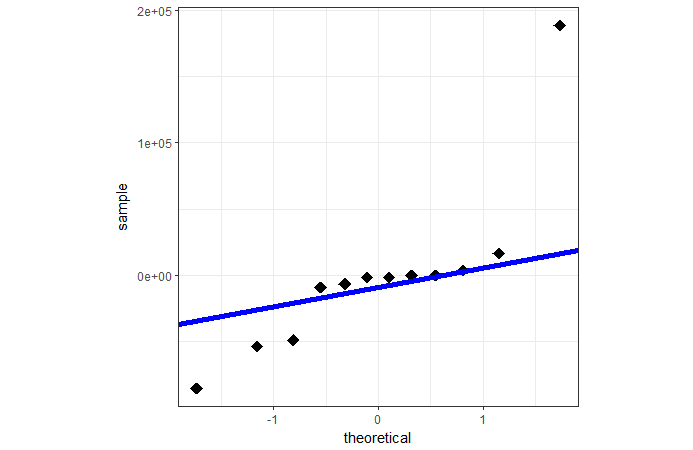

---
#  Probability plot to evaluate normality assumption 

par( pty = "s")
qqnorm ( AUC.df$Residuals , pch = 16, col = "blue", cex = 2, cex.lab = 1.5)
qqline ( AUC.df$Residuals , lwd = 3)


---
#  Outliers 

+ Causes
	+ Errors in collecting and/or recording of data
	+ Mistakes in technique
	+ Treatment and/or environment
	+ Affect statistical inference
	+ Inflation of estimated experimental error variance
	+ Influence estimate of treatment mean
	+ Investigate cause before discarding data
	+ Discarded data results in loss of information

---
#  Looking for outliers with residuals 

+ Large positive or negative values far removed from the 1-to-1 line in the normal QQ plot
	+ Points far removed from upper and lower boundaries of the Residuals versus Predicted values plot

---
#  Variance stabilizing transformations 

+ Used to change the scale of the observations
	+ To conform more closely with the ANOVA assumptions
	+ To provide more valid inferences from ANOVA
	+ Significance levels ( ) don’t apply to original data
	+ Conduct analysis and make all inferences on transformed
	+ Present summary tables on the original measurement scale

---
#  Apply log-transformation 

+ Recall our fitted model from First lecture
# Now carry out ANOVA on log-transformed data
> crd.lm  <- lm( logAUC ~ Surgery, data = AUC.df )
> anova ( crd.lm )
Analysis of Variance Table
Response: logAUC
 Df Sum Sq Mean Sq F value Pr (>F)
Surgery    2 22.0263 11.0132  16.359 0.001006 **
Residuals  9  6.0591  0.6732
---
Signif . codes:  0 ‘***’ 0.001 ‘**’ 0.01 ‘*’ 0.05 ‘.’ 0.1 ‘ ’ 1


---
#  Example: CRD 

Before Transformation
Residual plot
Effect tests
After transformation
Residual plot
Effect tests
 Df Sum Sq Mean Sq F value Pr (>F)
Surgery    2 22.0263 11.0132  16.359 0.001006 **
 Df  Sum Sq  Mean Sq  F value Pr (>F)
Surgery 2 4.3315e+10 2.1658e+10 4 0.05716
.pull-left[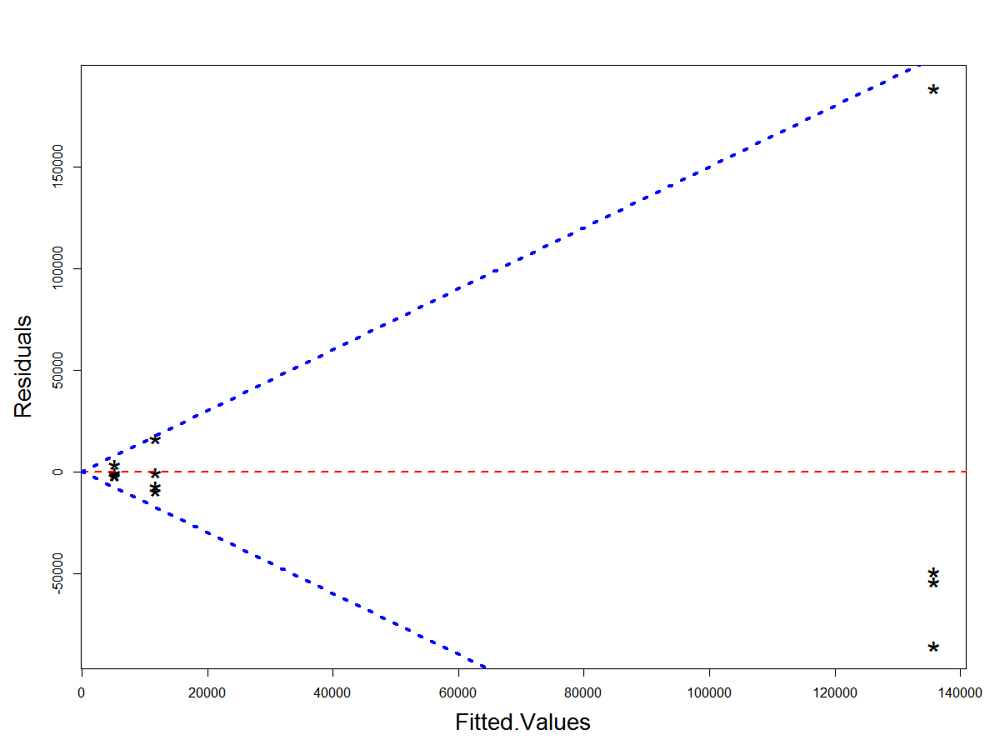]

.pull-right[]

---
#  Is normality assumption satisfied? 

Q-Q plots based on linear model fitted to AUC and log(AUC)
Does either appear to satisfy the normality assumption?
y = AUC
y = log(AUC)
.pull-left[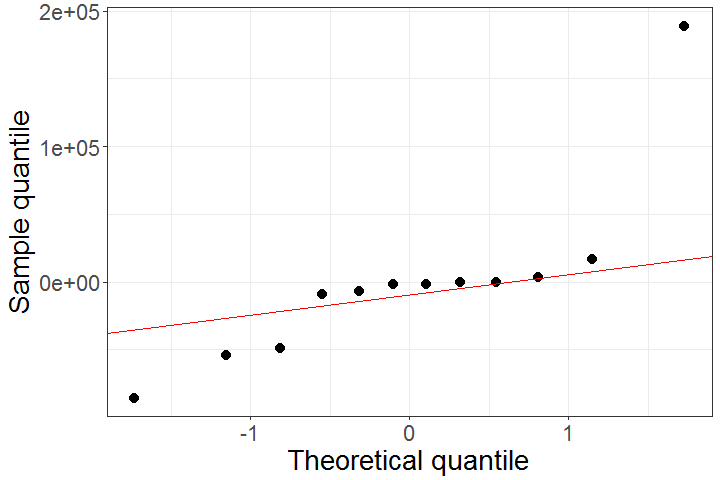]

.pull-right[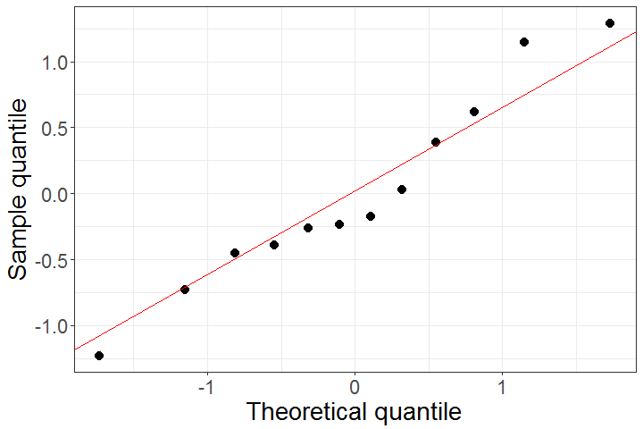]

---
#  Example: CRD 

Before Transformation
Comparison Difference      SED     LSD lowerLimit  upperLimit  p.value
C-P -6517.845 52030.64 117701.5 - 124219.3 111183.642  0.9031
C-S  -130582.934 52030.64 117701.5 -248284.4 -12881.448  0.0333
 P-S  -124065.089 52030.64 117701.5 - 241766.6  -6363.603  0.0409
After Transformation
Comparison Difference      SED     LSD lowerLimit  upperLimit  p.value
C-P -0.4900 0.58019 1.31247   -1.80247    0.82247  0.4202
C-S - 3.0875 0.58019  1.31247   -4.39997   -1.77503  0.0005
P-S -2.5975 0.58019 1.31247   -3.90997   -1.28503 0.0015

---
#  Example: CRD 

R code to generate “Before Transformation” table
 BY HAND , there is an easier way
# Predicted means, SEMs, SEDs, etc 
library ( Predictmean )
pm.lm  <-  predictmeans ( crd.lm , modelterm = "Surgery" ,
pairwise = TRUE )
pm.lm $ "Predicted  Means"
pm.lm $ "Standard  Error  of  Means"
pm.lm $ "Standard  Error  of  Differences"
pm.lm $ "LSD "
qt ( p = 0.975 , df = 9 )* pm.lm $ "Standard  Error  of  Differences" [ 3 ]
pwLSDs.pmlm   <-  pm.lm $ "Pairwise  LSDs"
diffs  <-  pwLSDs.pmlm [ upper.tri ( pwLSDs.pmlm )]
LSDs  <-  pwLSDs.pmlm [ lower.tri ( pwLSDs.pmlm )]
diffNames   <-  c ( "C-P" , "C-S" , "P-S" )
pValues.pmlm  <- pm.lm $ " Pairewise  p-values"
data.frame ( Comparison = diffNames , Difference = diffs,
 SED = pm.lm $ "Standard  Error  of  Differences" ,
LSD = LSDs, lowerLimit = diffs - LSDs, upperLimit = diffs + LSDs ,
 "p-value" = pValues.pmlm [ lower.tri ( pValues.pmlm )])

---
#  Example: CRD 


---
#  Example: CRD 


---
#  Example: CRD 


---
#  Example: CRD 

How do we interpret the results?
Back-transform (take exponential of) results in LSMeans Differences table to fill columns under “Original scale”
After Transformation
Comparison Difference      SED     LSD lowerLimit  upperLimit  p.value
C-P -0.4900 0.58019 1.31247   -1.80247    0.82247  0.4202
C-S - 3.0875 0.58019  1.31247   -4.39997   -1.77503  0.0005
P-S -2.5975 0.58019 1.31247   -3.90997   -1.28503 0.0015
Includes 1
Ratio far from 1

```{r tbl50, echo = FALSE}
tbl50 <- tibble::tribble(
~` `, ~`Log-scale`, ~` `, ~`Original scale`, ~` `,
"Comparison","Estimated Difference","Standard Error","Ratio","95% CI",
"C – P","-0.4900","0.5802","0.61","(0.16, 2.27)",
"C – S","-3.0875","0.5802","0.05","(0.01 0.17)",
"P – S","-2.5975","0.5802","0.07","(0.02, 0.28)"
)

kableExtra::kable_styling(knitr::kable(tbl50), font_size = 18)
```

---


---
#  Example: Proteome of lymph 

Completely Randomized Design
P
C
P
S
C
C
P
S
C
S
S
P

---
class: inverse
background-image: url('assets/img/image24.emf')
background-size: cover


---
class: inverse
background-image: url('assets/img/image23.emf')
background-size: cover


---
class: inverse
background-image: url('assets/img/image25.emf')
background-size: cover


---
#  Example: Proteome of lymph 

+ There are 3 group means…
	+ Which pairs, if any, are different from one another?
	+ Carry out multiple comparisons/hypothesis tests
+ H 01 :  Sham =  Pancreatitis
	+ H 02 :  Sham =  Shock
	+ H 03 :  Pancreatitis =  Shock

---
#  Statistical hypothesis testing 

Two competing claims, or hypotheses
+ Assertions about the true value of some population characteristic.
	+ E.g. population mean, μ
	+ Claim 1: Null  hypothesis, H 0  (no difference)
versus
+ Claim 2: Alternative  hypothesis, H A  (there is a difference)
	+ Usually the claim the researcher wants to validate

---

For any single hypothesis: Type I error
+ Declare a difference (i.e. reject H 0 ) when there is no difference (i.e. H 0 is true)
	+ Also known as a false positive or false discovery
	+ Risk of the Type I error is determined by the “level of significance”, i.e.
	+  = Pr (Type I error) = Pr (false discovery)
	+ We choose this!
		+  = 0.05 is a popular choice by biologists

---
#  Type II error 

+ Difference not declared (i.e. H 0 not  rejected) when there is a difference (i.e. H 0 is false)
	+ Also known as a false negative
	+  = Pr (do not reject H 0 when H 0 is false)
	+ So, what does 1 −  tell us?
1 − 	= Pr (reject H 0 when H 0 is false)
= Pr (a true positive)
+ This is the statistical power of the test!!

---
#  Relationship between Type I and Type II errors 

+ Reducing the chance of a Type I error increases the chance of a Type II error
	+ They are inversely related
	+ Type II error rate is determined by a combination of:
		+ Size of difference (of biological significance) between the true population means
		+ Experimental error variance
		+ Sample size, and
		+ Choice of Type I error rate ( )

---
#  Risks associated with hypothesis testing 

Decision
State of nature
Don’t reject H
0
Reject H
0
0
H
is true
Correct decision
Type I error
H
0
is false
Type II error
Correct decision

---
#  Let’s simulate this situation 

Sample from Population A (n=10)
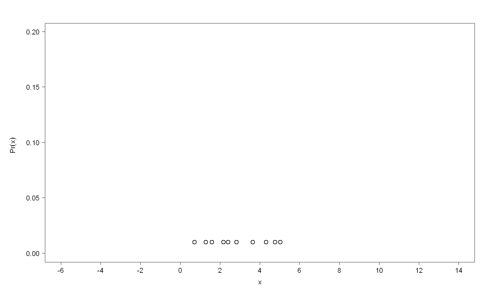

---
#  Let’s simulate this situation 

Sample from Population A (n=10)
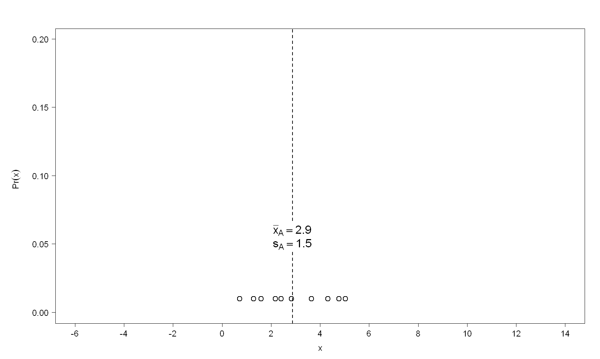

---
#  Let’s simulate this situation 

Sample from Population B (n=10)
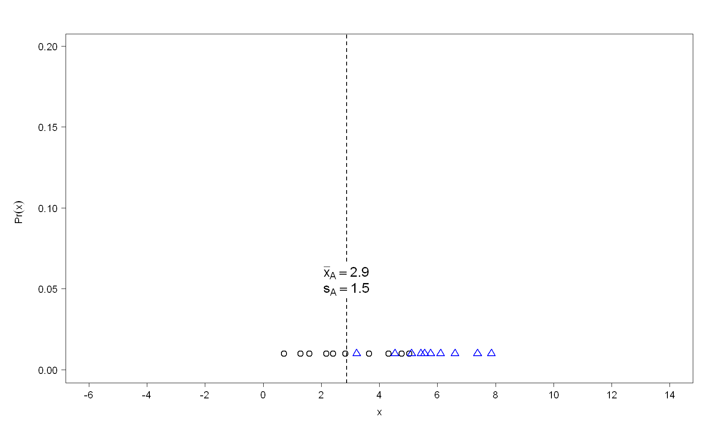

---
#  Let’s simulate this situation 

Sample from Population B (n=10)
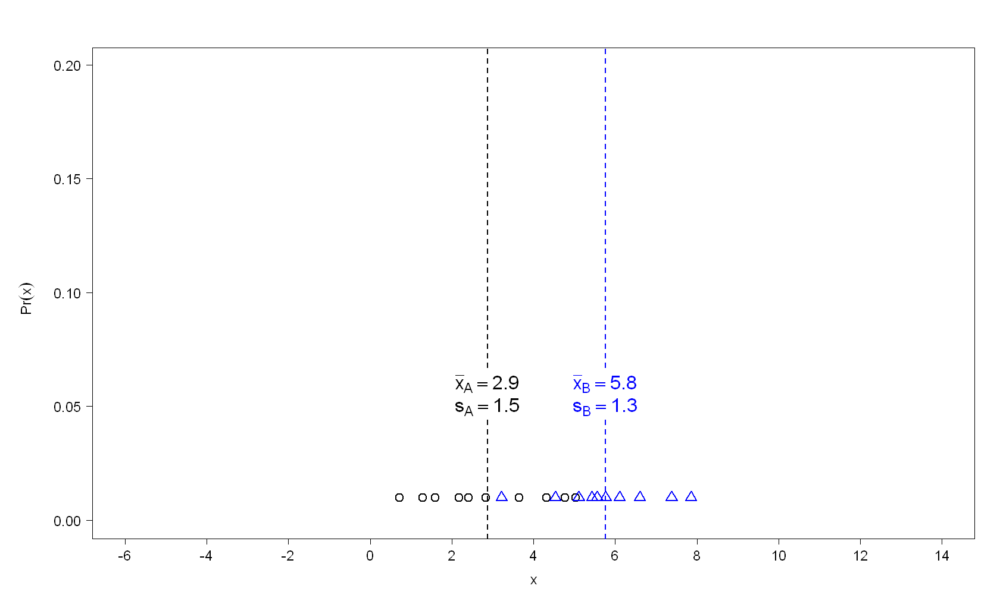

---
#  Let’s simulate this situation 

We will declare the p opulation means different if the p-value from the t -test is less than 0.05 !
Test  H 01 :  B −  A = 0


---
#  Let’s simulate this situation 

Difference = 2.9
SED = 0.6
t -statistic = 2.9/0.6 = 4.5
DF = 18
p-value = 0.0003
x B  – x A
Difference
We will declare the p opulation means different if the p-value from the t -test is less than 0.05 !
P opulation means are different!!
Test  H 01 :  B −  A = 0


---
#  Let’s simulate this situation 

P opulation means are different!!
TRUTH: Sampled from same population!!
Difference = 2.9
SED = 0.6
t -statistic = 2.9/0.6 = 4.5
DF = 18
p-value = 0.0003


---
#  Let’s simulate this situation 

How many false  positives in 1000 such trials (simulations)?
FALSE POSITIVE!!!
4.5%
Why?
We set the level of significance at 5%!
P opulation means are different!!
TRUTH: Sampled from same population!!
Difference = 2.9
SED = 0.6
t -statistic = 2.9/0.6 = 4.5
DF = 18
p-value = 0.0003
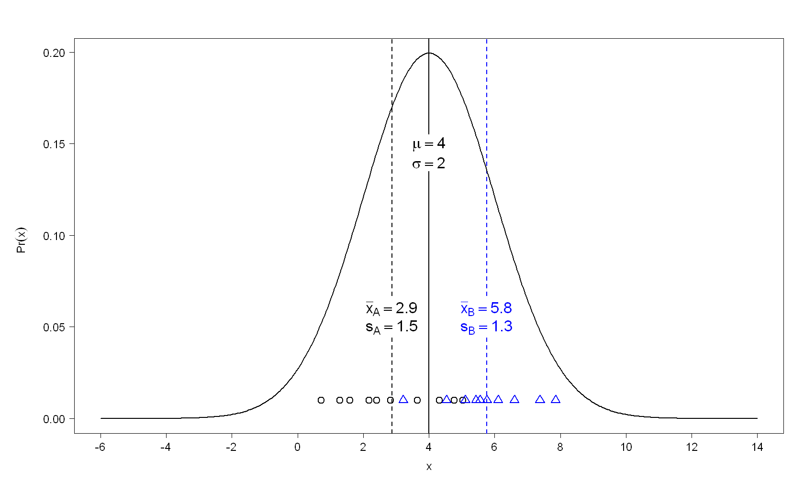

---
#  Let’s simulate this situation 

A vs B
A vs C
B vs C
Comparison
p -value
0.0003
0.6580
0.0114
*
*
Individual t -test Results
Pair-wise comparisons of 3 groups?

---
class: inverse
background-image: url('assets/img/image32.png')
background-size: cover


---
class: inverse
background-image: url('assets/img/image30.png')
background-size: cover


---
class: inverse
background-image: url('assets/img/image33.png')
background-size: cover


---
#  Let’s simulate this situation 

What’s the error rate in 1000 trials?
i.e. How often is a difference wrongly declared?
A vs B
4.5%
A vs C
5.4%
B vs C
6.1%
Comparison
False positives
Overall
12.4%

---
#  Example: Proteome of lymph 

+ Three pairwise comparisons of interest
	+ Sham vs Pancreatitis
	+ Sham vs Shock
	+ Pancreatitis vs Sham
	+ All of the population (true) means were actually equal.
	+ How many Type I errors could be committed?
Up to 3!!!
+ What might be the effect on the risk of a Type I error as the number of comparisons increases?
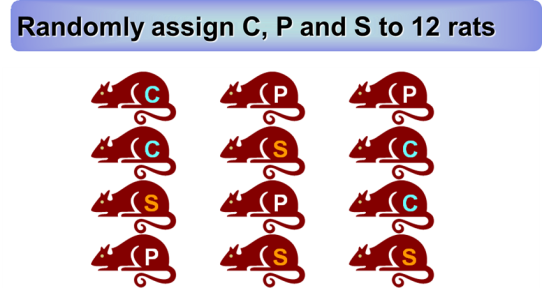

---
#  Example: Proteome of lymph 

What did the simulation show?
	+ Risk of Type I error increases with the number of comparisons!
A vs B
A vs C
B vs C
No. of
comparisons
1
Overall

4.5%

5.4%

6.1%


9.0%


9.2%


10.2%



12.4%
2
3
Comparison
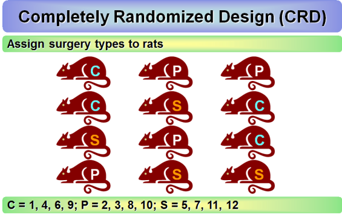

---
#  Example: Proteome of lymph 

A vs B: 4.5%		A vs C: 5.4%
+ Risk of Type I error increases with the number of comparisons!
	+ But 4.5 + 5.4 9.0%
1


9.0%
A vs B
A vs C
B vs C
No. of
comparisons
Overall

4.5%

5.4%
2
A vs B
A vs C
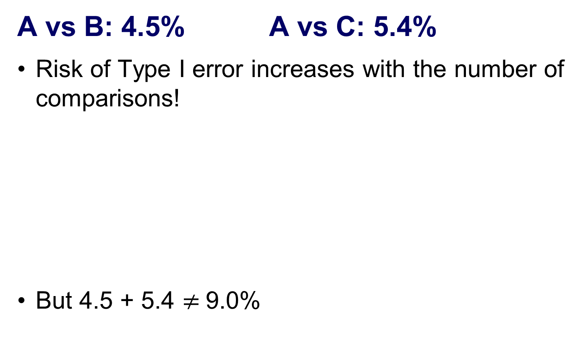

---
#  So what can we do? 

+ Control the Type I error rate across the entire “family” of tests under consideration.
Familywise  error rate
+ The risk of making at least one Type I error among the family of comparisons in the experiment
	+ Also known as the experimentwise error rate

---
#  Familywise error rate (FWER) 

+ Suppose we conduct m  independent  t -tests
	+ Assume H 0 is true for all m tests
	+ For any single test, let…
Pr (commit a Type 1 error) =  C
+ Known as the per comparison error rate ( PCER )
	+ What’s the probability a correct decision is made?
Pr (do not commit a Type 1 error) = 1 −  C

---
#  Familywise error rate (FWER) 

+ Probability of committing no Type I errors
(assuming m  independent  t -tests)
+ Probability of committing at least one Type I error
	+ 1 minus the probability of committing no Type I errors
+ denotes the upper limit of the FWER, i.e.
FWER ≤
+ We need to find the PCER when the FWER is

---
#  Familywise error rate (FWER) 

+ If we set FWER = , from previous slide:
(assuming m  independent  t -tests)
+ We need to make the subject in the above equation, i.e.

---
#  Familywise error rate (FWER) 

Why is  F the upper limit?
+ We assumed the tests are independent!
	+ Are the tests independent of one another?
	+ Consider again the CRD


---
#  Familywise error rate (FWER) 

Why is  F the upper limit?
+ There are three pairwise comparisons
	+ Null hypotheses:  P ‒  C = 0;  S  ‒  C  = 0;  P  ‒  S = 0
	+ What are the t -statistics for testing these null hypotheses?
	+ Let’s look at one of these, e.g. H 0 :  P ‒  C = 0
where is the SED of .

---
#  Familywise error rate (FWER) 

Why is  F the upper limit?
+ Consider the for the other hypothesis tests
	+ Do any of them share information?
		+ Some of the t -statistics share the same sample mean in their numerator; Sham vs Control, Sham vs Pancreatitis
		+ They all share the s 2 (from the ANOVA’s Residual MS)
	+ Let’s look at what happens to:
		+ the FWER,  F , when fix the PCER,  C ,  at 0.05, 0.01 and 0.10
		+ the PCER,  C  , when fix the FWER,  F ,  at 0.05, 0.01 and 0.10

---
#  F when C = 0.01, 0.05, 0.10  

Each test conducted with a PCER of  C = 0.01, 0.05 , 0.10 .
Risk of at least one Type I error escalates as  the number of tests increases.


---
#  C when F = 0.01, 0.05, 0.10  

Each test conducted with an FWER of  F = 0.01, 0.05 , 0.10 .
When we want to keep the risk of committing at least one Type I error fixed at  F = 0.05 , the PCER for m = 10 tests is 0.005 .
So what can we do?


---
#  Adjustments for multiple testing 

Fisher’s, Least Significant Difference, LSD
Bonferroni correction, i.e.
where = number of pairwise comparisons
Multiple comparison procedures
Tukey’s Honest Significant Difference (HSD)
Dunnett’s test
Lots more
False Discovery Rate (FDR)

---
#  Fisher’s LSD 

The idea:
Carry out post-hoc tests only if the ANOVA omnibus F -test is significant
Declare significant 100x α % any pairwise difference > LSD
Note: If α = 0.5, then 100 x α % = 5%
Does not control the FWER

---
#  Bonferroni correction 

We reject all null hypotheses for which the p-value
where
= FWER
= number of pairwise comparisons
Extremely general and simple , but often not powerful
It makes no assumptions about independence between tests
This means is invalid if this assumption is violated

---
#  Bonferroni inequality 

PCER,  C = 0.05 (Fisher’s LSD)
PCER,  B  =  C  /3 = 0.05/3 = 0.0167 ( Bonferroni correction)
Since we have only 3 means, and so only 3 comparisons division of PCER by 3
Does not change any of our conclusions – width of CI’s does not increase very much
.pull-left[]

.pull-right[]

---
#  Tukey’s Honest Significant Difference (HSD) 

+ Compares the mean of every treatment with the mean of every other treatment
	+ CRD example:
H 01 :  P −  c = 0
H 02 :  P −  S  = 0
H 03 :  S −  c  = 0
+ Uses Studentized range distribution, compared with t -distribution for Fisher’s LSD and Bonferroni correction:

---
#  Tukey’s Honest Significant Difference (HSD) 

+ Idea: If we pick out the tallest and shortest members of a class, they may appear to have significantly different heights, but in fact they are from the same population
	+ Somebody has to be the most extreme
	+ Tukey’s Honest Significant Difference (HSD ) adjusts for this
	+ Looks at the range, Biggest – Smallest, of a set of means
	+ Could these have come from the same underlying distribution?

---
#  Tukey’s Honest Significant Difference (HSD) 

+ Uses Tukey’s  Studentised Range
where m is the is -level critical value for m 	means.
$`Pairwise p-value`
C       P       S
C 0.0000 -0.8446 -5.3216
P 0.6863  0.0000 -4.4770
S 0.0012  0.0039  0.0000
"The matrix has t-value above the diagonal,
p-value (adjusted by ‘ tukey ’ method) below the diagonal"

---
#  Tukey’s Honest Significant Difference (HSD) 


---
#  Bonferroni vs Tukey’s HSD 

+ As the number of means, m, increases
	+ The number of pairs of means m(m-1)/2 = increases very rapidly
	+ Tukey’s HSD does not increase so rapidly
	+ Suppose SED = 1, PCER a = 0.05

```{r tbl89, echo = FALSE}
tbl89 <- tibble::tribble(
~`m`, ~`Comparisons`, ~`Bonferroni`, ~`Tukey HSD`,
"2","1","1.96","1.96",
"3","3","2.39","2.35",
"5","10","2.81","2.73",
"10","45","3.26","3.17"
)

kableExtra::kable_styling(knitr::kable(tbl89), font_size = 18)
```
