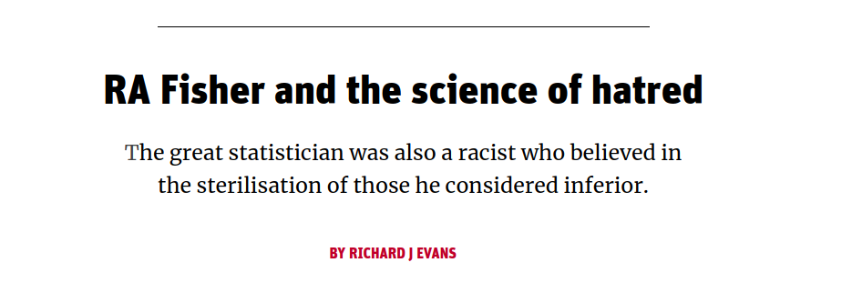

class: inverse, center, middle

```{r xaringan-themer, include=FALSE, warning=FALSE}
options(htmltools.dir.version = FALSE,cache = TRUE, warning = FALSE, message = FALSE)
library(xaringanthemer)
require(kableExtra)
style_solarized_light()
```

<style type="text/css">
.remark-slide-content {
    font-size: 20px;
    padding: 1em 4em 1em 4em;
}
</style>


# Experimental Design


---
class: inverse
## Learning Objectives


   + **Identify** the following
      + experimental unit
      + observational units
   + **List** and **describe** the three main principals of experimental design
       + Randomization
       + Replication
       + Blocking
   + **Discuss** the advantages and disadvantages of different designs
   + **Critique** experimental designs
   + **Communicate** statistical concepts and experimental outcomes clearly using language appropriate for both a **scientific** and **non-scientific** audience
   
---

# The language of design

.pull-left[
[Gertrude Mary Cox](https://en.wikipedia.org/wiki/Gertrude_Mary_Cox)]

.pull-right[

[William Gemmell Cochran](https://en.wikipedia.org/wiki/William_Gemmell_Cochran)]

[Cochran, William G.; Cox, Gertrude M. (1950). Experimental Designs. New York: Wiley.](https://www.wiley.com/en-us/Experimental+Designs%2C+2nd+Edition-p-9780471545675)

---

## The language of design

#### **Scientific objective:** The biological question (**AVOID BEING VAGUE**)
  + Should include details such as what is being *compared*, what is being *measured* and *how*, and under what *experimental conditions* etc.

--
### Compare three surgical conditionings of a biofluid...

--

### **Too vague!**

--

 + Which biofluid and collected from what?
 + How will they be compared?
    + What will be measured?
    + How will it be measured?
    + Under which experimental conditions?
    + By whom?
    
???

+ Organism? Male Wistar Rat
+ Cell, tissue, biofluid? Lymph
+ What? Global proteomic profile
+ Proteins + Abundances
+ How? 2D–LC–MS/MS

---
##  Key phrases


 **Experimental unit** Smallest portion of experimental material which is *independently* perturbed
 
--

**Treatment** The experimental condition *independently* applied to an experimental unit

--

**Observational unit** The smallest unit on which a response is measured. If one measurement is made on each rat: **Observational unit** = **Experimental unit**. If Multiple measurements are made on each rat: Each experimental unit has >1 observational unit (*pseudo-* or *technical replication*).

---
class: center, middle

## Experimental or Observational unit?

`r countdown::countdown(minutes = 5, font_size = "48px", top = 0)`

### [https://b.socrative.com/login/student/](https://b.socrative.com/login/student/)
### Room Name: BIOSCIUOA


---
class: center, middle

# Three key principles:


## **Replication**
## **Randomization**
## **Blocking**


---
### Fisher... 


.pull-left[

*a genius who almost single-handedly created the foundations for modern statistical science*]

--

.pull-right[
### You should also know

[](https://www.newstatesman.com/international/science-tech/2020/07/ra-fisher-and-science-hatred)

[RA Fisher and the science of hatred](https://statmodeling.stat.columbia.edu/2020/08/01/ra-fisher-and-the-science-of-hatred/)

[\#Topple The Racists](https://www.bbc.com/news/uk-england-cambridgeshire-53023823)]


---

class: inverse

# 1st major principle: Replication


---

class: inverse

# 1st major principle: Replication

+ **Biological replication:** each treatment is *independently* applied to each of several humans, animals or plants
  + To generalize results to population

--

+ **Technical replication:** two or more samples from the same biological source which are *independently* processed
  + Advantageous if processing steps introduce a lot of variation
  + Increases the precision with which comparisons of relative abundances between treatments are made
  
--

+ **Pseudo-replication:** one sample from the same biological source, divided into two or more aliquots which are **independently** measured
  + Advantageous for noisy measuring instruments
  + Increases the **precision** with which comparisons of relative abundances between treatments are made
  
---

class: inverse

# 2nd major principle: Randomisation


---

class: inverse

# 2nd major principle: Randomisation

+ **Protects against bias**


+ Plan the experiment in such a way that the variations caused by extraneous factors can all be combined under the general heading of "chance".

+ Ensures that each treatment has the same probability of getting good (or bad) units and thus
avoids systematic bias
+ random allocation can cancel out population bias; it ensures that any other possible causes for the experimental results are split equally between groups
+ typically statistical analysis assumes that observations are **independent**. This is almost never strictly true in practice but randomisation means that our estimates will behave as if they were based on independent observations

---

class: inverse

# 3rd major principle: Blocking


---

class: inverse

# 3rd major principle: Blocking


Blocking helps **control variability** by making treatment groups more alike. Experimental units are divided into subsets (called blocks) so that units within the same block are more similar than units from different subsets or blocks. 

Blocking is a technique for dealing with *nuisance factors*.

A *nuisance factor* is a factor that has some effect on the response, but is of no interest (e.g., age class).


---

# Other resources


[Glass, David J. Experimental Design for Biologists. Second ed. 2014. Print.](https://catalogue.library.auckland.ac.nz/primo-explore/fulldisplay?docid=uoa_alma21237737730002091&search_scope=Combined_Local&tab=books&vid=NEWUI&context=L)

[Welham, S. J. Statistical Methods in Biology : Design and Analysis of Experiments and Regression. 2015. Print.](https://catalogue.library.auckland.ac.nz/primo-explore/fulldisplay?docid=uoa_alma21237737830002091&search_scope=Combined_Local&tab=books&vid=NEWUI&context=L)

[Fisher, Ronald Aylmer. The Design of Experiments. 8th ed. Edinburgh: Oliver & Boyd, 1966. Print. O & B Paperbacks.](https://catalogue.library.auckland.ac.nz/primo-explore/fulldisplay?docid=uoa_alma21198532990002091&context=L&vid=NEWUI&lang=en_US&search_scope=Combined_Local&adaptor=Local%20Search%20Engine&isFrbr=true&tab=books&query=any,contains,The_Design_of_Experiments&sortby=date&facet=frbrgroupid,include,627497507&offset=0)


---
class: inverse, center, middle

# One-Way **An**alysis **o**f **Va**riance (ANOVA)
## Sums of Squares (SS)
## Mean Sums of suares (MSS)
## Degrees of freedom

---
class: inverse
## Learning Objectives

---

## The data

```{r data-quiet, message = FALSE, echo = FALSE}
library(tidyverse)
rats <- read_csv("../data/crd_rats_data.csv")
```

```{r, echo = FALSE, results = "asis"}
knitr::kable(rats)
```

---

**The idea**: Assess **distances** between treatment (*surgical condition*) means relative to our uncertainty about the actual (*true*) treatment means.

```{r, echo = FALSE}
means <- rats %>% group_by(Surgery) %>% summarise(avg = mean(logAUC))
mean <- mean(rats$logAUC)
ggplot(rats, aes(x = Surgery, y = logAUC)) + 
    geom_violin()  + 
  ylab("logAUC") +
  xlab("Treatment") +
  geom_point(data = means, aes(x = Surgery, y = avg, color = Surgery), size = 2) +
  geom_text(data = means, aes(x = Surgery, y = avg + 0.25, color = Surgery, label = paste0("Treatment mean = ",round(avg,3)))) +
  geom_hline(data = means, aes(yintercept = avg, color = Surgery), alpha = 0.3, lty = 2) +
  geom_hline(yintercept = mean, color = "red") +
  annotate(geom = 'text', label = paste0("Overall average = ",round(mean,3)) , 
           x = -Inf, y = Inf, hjust = 0, vjust = 1.5, color = "red")
  
  
```

---
 **The idea**: Assess **distances** between treatment (*surgical condition*) means relative to our uncertainty about the actual (*true*) treatment means.

```{r, echo = FALSE}
means <- rats %>% group_by(Surgery) %>% summarise(avg = mean(logAUC))
mean <- mean(rats$logAUC)
means$ends <- mean
ggplot(rats, aes(x = Surgery, y = logAUC)) + 
    geom_violin()  + 
  ylab("logAUC") +
  xlab("Treatment") +
  geom_point(data = means, aes(x = Surgery, y = avg, color = Surgery), size = 2) +
  geom_text(data = means, aes(x = Surgery, y = avg + 0.25, color = Surgery, label = paste0("Treatment mean = ",round(avg,3)))) +
  geom_hline(data = means, aes(yintercept = avg, color = Surgery), alpha = 0.3, lty = 2) +
  geom_hline(yintercept = mean, color = "red", alpha = 0.3) +
  annotate(geom = 'text', label = paste0("Overall average = ",round(mean,3)) , 
           x = -Inf, y = Inf, hjust = 0, vjust = 1.5, color = "red") +
  geom_segment(data = means, aes(x = Surgery, y = avg, xend = Surgery, yend = ends,color = Surgery), size = 1) +
  geom_text(data = means, aes(x = Surgery, y = ends + 0.25, color = Surgery, label = paste0("diff to overall = ",round(avg - ends,3))))
  
  
```

--

**add up the differences:** `r round(means$avg[1] - mean,3)` + `r round(means$avg[2] - mean,3)` + `r round(means$avg[3] - mean,3)` = `r round(sum(means$avg - mean),3)`. **This is always the case!**

---
**So adding up the differences:** `r round(means$avg[1] - mean,3)` + `r round(means$avg[2] - mean,3)` + `r round(means$avg[3] - mean,3)` = `r round(sum(means$avg - mean),3)`. **Not a great way to measure distances!**

--

**Sums of Squares?** 

--

$`r round(means$avg[1] - mean,3)`^2 + `r round(means$avg[2] - mean,3)`^2 + `r round(means$avg[3] - mean,3)`^2$

**add up the squared differences?** but... there are 4 observations in each group (treatment)

--

$4\times(`r round(means$avg[1] - mean,3)`)^2 + 4\times(`r round(means$avg[2] - mean,3)`)^2 + 4\times(`r round(means$avg[3] - mean,3)`)^2$

This is the **Between Groups Sums of Squares** or the **Between group SS (SSB)** 

--

So the Between group SS (SSB) = `r sum(4*((means$avg - mean)^2))`

---

**Adding up the differences:** `r round(means$avg[1] - mean,3)` + `r round(means$avg[2] - mean,3)` + `r round(means$avg[3] - mean,3)` = `r round(sum(means$avg - mean),3)`. **This is always the case** and that itself gives us information...

--

**We only need to know two of the values to work out the third!**

So we have only 2 bits of **unique** information; **SSB degrees of freedom** = 2


---
Now:  Each observation (*logAUC*) can be *decomposed* in the same way

```{r, echo = FALSE, results = "asis"}
rats_df <- rats %>% mutate(ov_avg = mean(logAUC)) %>% 
  group_by(Surgery) %>% mutate(tr_avg = mean(logAUC), tr_avg_minus_ov_avg = mean(logAUC) - ov_avg,
                               obvs_minus_tr_avg = logAUC - mean(logAUC))
knitr::kable(rats_df, format = 'html')
```


---

`logAUC` = `ov_avg` + `tr_avg_minus_ov_avg` + `obvs_minus_tr_avg` $\rightarrow$ **observation** = **overall average** + **treatment average minus overall average** + **observation minus treatment average**

```{r, echo = FALSE, results = "asis"}
rats_illus <- select(ungroup(rats_df), -c(Surgery,Rat, tr_avg))
rats_illus <- add_column(rats_illus, "equals" = "=", .after = "logAUC")
rats_illus <- add_column(rats_illus, "add" = "+", .after = "ov_avg")
rats_illus <- add_column(rats_illus, "plus" = "+", .after = "tr_avg_minus_ov_avg")
knitr::kable(rats_illus, format = 'html')
```

---
Remember the **Between group SS (SSB)** *variation due to treatments*

--

The **Within group SS (SSW)** arises from the same idea:

To assess distances between treatment (surgical condition) means **relative** to our uncertainty about the actual (true) treatment means.

--

Procedure:

 + Observation - Treatment mean
 + Square the difference
 + Add them up!
 
---
**Within group SS (SSW)** *unexplained variance*

```{r,echo = FALSE}
jit <- ggplot() + 
  ylab("logAUC") +
  xlab("Treatment") +
  geom_point(data = means, aes(x = Surgery, y = avg, color = Surgery), size = 2) +
  geom_text(data = means, aes(x = Surgery, y = avg + 0.25, color = Surgery, label = paste0("Treatment mean = ",round(avg,3)))) +
  geom_hline(data = means, aes(yintercept = avg, color = Surgery), alpha = 0.3, lty = 2) +
  geom_jitter(data = rats, aes(x = Surgery, y = logAUC))

rats_df$x_points <- layer_data(jit,i = 4)$x
rats_df$y_points <- layer_data(jit,i = 4)$y

jit + 
  geom_segment(data = rats_df, aes(x = x_points, y = y_points, xend = x_points, yend = tr_avg,color = Surgery), size = 1) 
```

---

Recall the Between group SS (**SSB**) = `r sum(4*((means$avg - mean)^2))`

So mean **SSB** =  `r sum(4*((means$avg - mean)^2))` / 2

--

The within group SS (**SSW**) = `r sum(rats_df$obvs_minus_tr_avg^2)`

Here we have $2\times 3$ bits of *unique* information: within groups **degrees of freedom** is 9.

So mean **SSW** = `r round(sum(rats_df$obvs_minus_tr_avg^2),3)`/9

--

Consider the ratio ${\frac  {{\text{variation due to treatments}}}{{\text{unexplained variance}}}} = {\frac  {{\text{ mean between-group variability}}}{{\text{mean within-group variability}}}}$  $=\frac{\text{mean SSB}}{\text{mean SSW}}$ $=\frac{\text{MSB}}{\text{MSW}}$  = $=\frac{\text{experimental variance}}{\text{error variance}}$ `r (sum(4*((means$avg - mean)^2))/2)/(sum(rats_df$obvs_minus_tr_avg^2)/9)`

--

This is the **F-statistic**... more to come!


---
class: inverse, center, middle

# Analysis of a Completely Randomised Design in `R`
## `lm()` and `aov()`

---
class: inverse
## Learning Objectives

+ **Explain** between group and within group variation
+ **Describe** a Completely Randomised (experimental) Design 
+ **Carry** out linear regression in `R` with one categorical explanatory variable (one-way ANOVA) and **draw** the appropriate inference
+ **Communicate** statistical concepts and experimental outcomes clearly using language appropriate for both a **scientific** and **non-scientific** audience

---

## Everything is a regression...


---

## Looking forward

| Traditional name    | Model formula  | R code  |
| ------------------- |:--------------:| -------:|
| Simple regression   | $Y \sim X_{continuous}$ | `lm(Y ~ X)` |
| One-way ANOVA       | $Y \sim X_{categorical}$      |   `lm(Y ~ X)` |
| Two-way ANOVA       | $Y \sim X1_{categorical} + X2_{categorical}$| `lm(Y ~ X1 + X2)` |
| ANCOVA              | $Y \sim X1_{continuous} + X2_{categorical}$ |`lm(Y ~ X1 + X2)` |
| Multiple regression | $Y \sim X1_{continuous} + X2_{continuous}$ | `lm(Y ~ X1 + X2)` |
| Factorial ANOVA     | $Y \sim X1_{categorical} * X2_{categorical}$|   `lm(Y ~ X1 * X2)` or `lm(Y ~ X1 + X2 + X1:X2)` |
---

## One-way ANOVA


```{r data, message = FALSE, eval = FALSE}
library(tidyverse)
rats <- read_csv("crd_rats_data.csv")
```

```{r means}
rats %>%
  group_by(Surgery) %>%
  summarise(avg = mean(logAUC))
```


---

## One-way ANOVA `aov()`


```{r aov}
rats_aov <- aov(logAUC ~ Surgery, data = rats)
rats_aov
```

.footnote[recognize the **Sums of Squares** values?]
---

## One-way ANOVA `lm()`

```{r lm}
rats_lm <- lm(logAUC ~ Surgery, data = rats)
anova(rats_lm)
```

.footnote[recognize the **Sums of Squares** values?]
---


## Inference

Hypothesis: We test the Null hypothesis, $H_0$, population (`Surgery`) means are the same on average verses the alternative hypothesis, $H_1$, that **at least one** differs from the others!

Probability of getting an **F-statistic** at least as extreme as the one we observe (think of the area under the tails of the curve below) **p-value** Pr(>F)= `r round(anova(rats_lm)$"Pr(>F)"[1],4)` tells us we have sufficient evidence to reject $H_0$ at the 1% level of significance


---

## Inference


```{r f, echo = FALSE}
stats_df <- data.frame(Fs = summary(rats_aov)[[1]][[4]][[1]])
crit_df <- as.data.frame(apply(stats_df,2,rep,each = 100))
crit_df$Fs <- c(sapply(stats_df$Fs, function(x) seq(x,20, length.out = 100)))
crit_df$y <- df(crit_df$Fs,df1 = 2,df2 = 9) ## corresponding F val
ggplot(stats_df,aes(x = Fs)) +
  geom_vline(aes(xintercept = Fs)) +
    geom_line(data = data.frame(x = seq(0,20,.1),
                              y  = df(seq(0,20,.1),df1 = 2,df2 = 9)),
              aes(x = x,y = y), alpha = 0.7) +
    theme(legend.position = "none") +
    ylab("density") +
    xlab("F-value") +
    geom_area(data = crit_df,mapping = aes(x = Fs,y = y),fill = "blue") +
  geom_line(data = crit_df,mapping = aes(x = Fs,y = y),color = "blue") +
  geom_text(aes(4, 1,label = paste("F-statistic:", format(round(Fs, 2), nsmall = 2))),
              size = 4, hjust = 0, color = "black")  +
  geom_text(aes(4, 0.95,label = paste("p-value:", format(round(pf(Fs,2,9,lower.tail = FALSE),4), 
                                                         nsmall = 2))),
              size = 4, hjust = 0, color = "blue") 

```
---

# `r emo::ji('scream')` p-values `r emo::ji('scream')`

### [The ASA Statement on p-Values: Context, Process, and Purpose](https://www.tandfonline.com/doi/full/10.1080/00031305.2016.1154108)

**Q:** Why do so many colleges and grad schools teach *p-val*=0.05?


**A:** Because that's still what the scientific community and journal editors use.


**Q:** Why do so many people still use *p-val*=0.05?


**A:** Because that's what they were taught in college or grad school. 

---

# `r emo::ji('scream')` p-values `r emo::ji('scream')`

**What is a p-Value?**

Informally, a p-value is the probability under a specified statistical model that a statistical summary of the data (e.g., the sample mean difference between two compared groups) would be equal to or more extreme than its observed value


---
# `r emo::ji('scream')` p-values `r emo::ji('scream')`

**p-values** can indicate how incompatible the data are with a specified statistical model

--

p-values **do not** measure the probability that the studied hypothesis is true, or the probability that the data were produced by random chance alone

--

Scientific conclusions and business or policy decisions **should not** be based only on whether a p-value passes a specific threshold

--

Proper inference requires **full** reporting and transparency

--

A p-value, or statistical significance, does **not** measure the size of an effect or the importance of a result

--

By itself, a p-value does **not** provide a good measure of evidence regarding a model or hypothesis

---
# `r emo::ji('scream')` p-values `r emo::ji('scream')`

> "Good statistical practice, as an essential component of good scientific practice, 
> emphasizes principles of good study design and conduct, a variety of numerical 
> and graphical summaries of data, understanding of the phenomenon under study, 
> interpretation of results in context, complete reporting and proper
> logical and quantitative understanding of what data summaries mean. 
> No single index should substitute for scientific reasoning."


> `r tufte::quote_footer('--- ASA Statement on p-Values')`


---
class: inverse

The **ANOVA** enables us to:

 + Test only  the global null hypothesis of *no difference between any of the treatment groups' means*
	
 + Estimate the population variance. (We'll come back to why this is important)

--

But...


A primary goal of our experiment

  + *Biologically speaking:* To identify which pairs  of treatments are biologically different from one another
  
  + *Statistically speaking:* To identify which pairs of treatment means  are statistically  different from one another 


---

## Inference `lm()`

```{r lmsum}
summary(rats_lm)$coef
```

.footnote[Taking **treatment** `SurgeryC` as the **baseline**...]
---
class: center, middle


```{r, echo = FALSE}
means$base <- summary(rats_lm)$coef[1,1]
ggplot(rats, aes(x = Surgery, y = logAUC)) + 
    geom_violin()  + 
  ylab("logAUC") +
  xlab("Treatment") +
  geom_point(data = means, aes(x = Surgery, y = avg, color = Surgery), size = 2) +
  geom_text(data = means, aes(x = Surgery, y = avg + 0.25, color = Surgery, label = paste0("Treatment mean = ",round(avg,3)))) +
  geom_hline(data = means, aes(yintercept = avg, color = Surgery), alpha = 0.3, lty = 2) +
  geom_segment(data = means[2:3,], aes(x = Surgery, y = avg, xend = Surgery, yend = base,color = Surgery), size = 1) +
  geom_text(data = means[2:3,], aes(x = Surgery, y = base - 0.25, color = Surgery, label = paste0("diff to baseline = ",round(avg - base,3)))) +
  geom_hline(data = means[1,], aes(yintercept = avg, color = Surgery)) +
  geom_text(data = means[1,],aes(x = Surgery, y = base - 0.25, color = Surgery, label = paste0("Baseline = ",round(avg,3))))
  
```